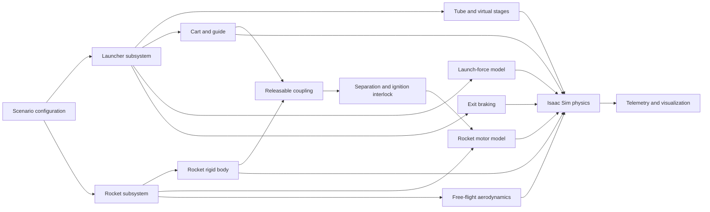
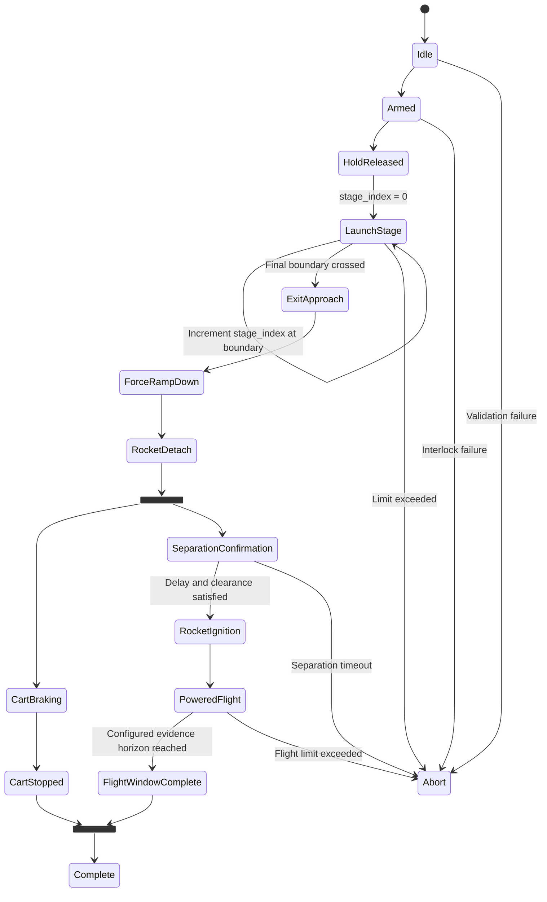

# Configurable Vacuum-Tube Electromagnetic Launch Simulation

**Document status:** Draft for panel review  
**Version:** 0.32  
**Date:** 2026-09-01  
**Target platform:** NVIDIA Isaac Sim 6.0.1-rc.7; backend qualified against the exact implementation build  
**Codebase review reference:** `987015050efebfd0cd5d3736ae47fffe5adee308`  
**Document purpose:** Review, approve, and track the staged implementation of the simulation architecture

### Revision history

| Version | Date | Summary |
|---|---|---|
| 0.1 | 2026-08-30 | Initial panel-review draft. |
| 0.2 | 2026-08-30 | Incorporated panel feedback after first-principles review; clarified uniform tube diameter, indexed stage control, diagnostic data, force ownership, relative-air drag, energy tolerances, and separation assumptions. |
| 0.3 | 2026-08-30 | Addressed codebase-grounded review: made the physics backend qualification-driven, specified constraint/release behavior, corrected concurrent completion, added critical schema and lifecycle fields, and made telemetry identity and separation gates executable. |
| 0.4 | 2026-08-30 | Added a minimal backend-neutral component/effect contract and attributable ablation manifest; corrected effective-density terminology, guide/contact semantics, release ordering, boundary crossing, observation ownership, and evidence-run reproducibility. |
| 0.5 | 2026-08-30 | Corrected against the target build's source. Anti-tunneling no longer presumes CCD is backend-neutral; engine resolution, stepping mode, and adapter frame/order conventions are now pinned; release transaction requires an explicit physics resync; energy residual includes resistance work; acceleration ceiling is enforced in the control law. |
| 0.6 | 2026-08-30 | Added a planar curved-launcher candidate for panel review: arc-length centerline, tangent/normal frames, curvature-continuous clothoid transitions, vector 10G load enforcement, a 2 km/s high-altitude reference trajectory, curved-guide qualification, schema migration, and explicit implementation/review gates. The existing straight schema and code remain the implemented baseline until this change is approved. |
| 0.7 | 2026-08-30 | Independent recomputation of the v0.6 curved candidate. Every published geometry, kinematic, load, jerk, and braking figure reproduced; the corrections are to modelling scope and to configuration fields the stated rules require but the candidate omitted. Added an altitude-dependent exterior atmosphere (the constant-exterior baseline costs 466 m/s over the free-flight window), a resolved-speed blend distance, named anti-tunneling pairs with their release-speed consequence for backend selection, the missing acceleration ceiling, a force ceiling that cannot breach the resultant limit by construction, and a corrected altitude attribution for the exit density ratio. |
| 0.8 | 2026-08-30 | Closed the independent v0.7 specification findings: made the 25 km braking track an explicit tangent-continuous 15-degree continuation, enforced a separate 10G resultant cart-load budget, defined oriented signed curvature, reconciled schema-v3 exterior-atmosphere validation, added explicit evidence-horizon and run-time feasibility fields, required atmosphere-stage-count convergence, and synchronized the implementation handoff. |
| 0.9 | 2026-08-30 | Verified every v0.8 figure by independent recomputation; all reproduced. Carried the v0.8 cart-load reasoning back to the attached assembly, where the no-gravity-credit guide-normal bound reported zero on zero-curvature segments, and replaced it with a two-sided bound valid everywhere. Corrected the cart stop-time figure and the constant-radius reaction notation. No published load, geometry, or braking value changed. |
| 0.10 | 2026-08-30 | Implemented the backend-neutral schema-v3 curve slice without changing the schema-v2 baseline: strict configuration loading, planar straight/clothoid/arc centerline resolution and projection, arc-length atmosphere stages and deterministic refinement, exterior atmosphere and evidence fields, exit-track continuity, two-sided guide-normal and normal-jerk validation, vector load budgets, braking and run-time feasibility, and the checked-in 2 km/s reference configuration. The physical Isaac guide, tube mesh, and scene remain gated by Phase 0. |
| 0.11 | 2026-08-30 | Implemented the next Phase 1 execution slice: a deterministic translation-only analytic backend, effective-density guided/cart drag, all four abstract axial launch-control modes, acceleration-before-force and resultant-vector limiting, a strict force-versus-position table schema, the ideal analytic path guide, the jerk-limited vector-supervised cart brake, and contact-free guided/braking runners using the common effect boundary. Defined the previously implicit rest-state ramp bootstrap. The configured 1 ms curved analytic run reaches 1,999.991 m/s in 54.115 s with 7.668G peak resultant load and 49.375 m/s³ peak normal jerk; its cart then stops in 23.000 km and 22.504 s at a 9.066G peak without reversal. These are pure-core regression results, not Isaac evidence. |
| 0.12 | 2026-08-30 | Closed the execution-slice review findings. Force-specified modes now cap delivered force at the authored request even when that request is below the hold bias; nearest-path projection extrapolates along both endpoint tangents and is inverse-consistent with `path_pose` outside the authored interval; and the analytic runner reports Section 7 normal jerk from the accepted tangential acceleration instead of finite-differencing the guide-normal bound. Four regressions bring the pure-core suite to 73 passing tests. The schema-v2 evidence hash, resolved curve geometry, exit speed, peak load, energy convergence, and braking result are unchanged. |
| 0.13 | 2026-08-30 | Implemented the next backend-neutral Phase 1 slice: the reversible fixed-joint coupling and ordered six-step release transaction, explicit physics resync and mutation-time continuity check, named-envelope passive-separation measurement and monitoring, all seven ignition gates, constant-mass body-axial rocket thrust, detached-rocket point drag, a finite mission state machine with concurrent cart/rocket branches, and the common mission orchestrator. The cart's stopped latch now applies a physical hold force and removes residual sub-threshold speed instead of being a label only. A complete schema-v2 analytic mission verifies release, separation, ignition, independent forces, concurrent completion, fail-closed event ordering, and bit-identical reset/replay. Six new tests bring the pure-core suite to 79 passing tests. Physical live release and contact behavior remain Phase 0 qualification items. |
| 0.14 | 2026-08-30 | Review of the v0.13 slice. Moved the release continuity check from step (5) to step (4) in section 10.2, where it is actually performed and where it is the only meaningful place to perform it, and propagated that to the section 16.2 and Phase 0 qualification items. Recorded the force-free mutation step. The implementation additionally now adjudicates the ignition interlock from the separation monitor's real confirmation flag on every post-release step, so the clearance gate can fail rather than being passed a literal, and the mission wiring moved out of the test suite into a `build_mission` factory. |
| 0.15 | 2026-08-30 | Implemented the backend-neutral telemetry and evidence-output slice: a versioned closed core schema with explicit type, SI unit, frame, sample phase, per-field validity, and `[w, x, y, z]` quaternion order; streaming CSV, registered diagnostic JSONL, and monotonically sequenced event JSONL; distinct pre-state, observation, command, accepted-effect, backend-applied-effect, post-state, and derived-post records; applied-effect energy accounting including resistance work; run summaries; and collision-safe, non-content-derived run-instance paths. The mission orchestrator now streams and finalizes this evidence throughout a run. Five telemetry regressions bring the pure-core suite to 85 passing tests. Translational-plus-gravitational closure fails closed when angular velocity is nonzero because the current body contract has no inertia. Swept-envelope geometry, experiment manifests/contrasts, and the Isaac layer remain open. |
| 0.16 | 2026-08-30 | Review of the v0.15 telemetry slice. Rotational incompleteness now invalidates the energy channels instead of raising: the previous 1e-9 rad/s guard aborted the run for a rocket rotating well inside the 5 deg/s the section 10.4 ignition gate permits, and section 14 requires an unavailable value to be recorded as null with a validity flag rather than to end the record. Added the separation work term \(W_{sep}\) to the section 16.2 identity, with a startup check that every wrench-emitting slot maps to a work term, so a later pusher model cannot silently move its work into the residual. |
| 0.17 | 2026-08-30 | Implemented the backend-neutral experiment-provenance slice: complete fail-closed manifests for every component slot and every Section 14.1 identity field; canonical parameter, state, configuration, scene, and geometry hashes; code identity over an explicitly declared project dependency closure plus resolved external versions; versioned criterion policies and schema-v2 evidence-window resolution; access-order-independent named random streams; exact nested factor diffs; and paired adjacent/baseline contrasts that reject changed stream seeds or initial states. The production mission factory now uses the conservative full pure-core package closure instead of placeholder code-hash labels. Eight focused regressions bring the current pure-core suite to 94 passing tests. Swept-envelope clearance geometry is the remaining backend-neutral Phase 1 implementation item. |
| 0.18 | 2026-08-30 | Review of the v0.17 provenance slice. Verified the section 14.1 closure property directly: editing a shared helper changes every component identity, the hash is byte-exact, import-path independent, and stable across processes. Two gaps closed. The resolved interpreter is now recorded in both the code identity and the manifest, read from the running process rather than declared, because the standard library the pure core depends on is version-dependent and the Isaac Sim build field cannot be verified. Test sources are excluded from the closure so that a Kit test edit cannot read as a behavioral change and invalidate the paired contrasts. |
| 0.19 | 2026-08-31 | Completed the backend-neutral Phase 1 geometry core with a conservative swept-envelope certificate. Tangent-aligned rigid bodies use the global-curvature bound \(r_{body}+\kappa_{max}\ell^2/2\); the tube checks local regularity \(\kappa_{max}R<1\) and rejects nonlocal branches closer than \(2R\) using a spatially indexed polyline with a bounded-curvature chord-error pad. The checks run in configuration preflight for both schemas and reject longitudinally oversized bodies, locally singular tube sweeps, self-intersection, and ambiguous projection. The 2 km/s reference is cart-limited with 0.317531 m certified wall clearance after its 0.05 m guide allowance; the rocket has 0.699967 m. Two new hostile/reference tests bring the pure-core suite to 97 passing tests. The backend-neutral Phase 1 implementation is complete; Phase 0 physical guide/release/contact qualification remains the next gate. |
| 0.20 | 2026-08-31 | Closed the independent review of the v0.19 geometry slice. The downrange invariant is now evaluated exactly from per-segment tangent-angle extrema, so a localized reversal cannot hide between uniform samples. Global-to-local endpoint conversion is clamped after segment selection, eliminating accumulated-float rejection at valid authored endpoints. The nonlocal-overlap index now sizes cells from the longest polyline chord as well as the padded detection distance, bounding each inserted chord AABB to at most four cells instead of exhausting memory for small-radius tubes. Three discriminating regressions bring the pure-core suite to 100 passing tests; compileall and the forbidden-import check remain clean. Phase 1 sign-off is restored, with Phase 0 still the next gate. |
| 0.21 | 2026-08-31 | Began executable Phase 0 qualification on Isaac Sim 6.0.1-rc.7. A backend-neutral fixed-base articulation with an internal 45-degree prismatic DOF now proves tensor force, generalized axial effort, fixed-joint release continuity, reaction-reporting capability, collision activation/contact reporting, and reset lifecycle behavior on CPU PhysX and Newton. Both reproduce free rigid-body force. PhysX reproduces prismatic effort within 0.7 ppm and reports incoming joint wrenches; Newton exposes a 0.1 kg default joint armature and does not implement incoming joint-reaction wrenches. Both require stop/rebuild/view recreation for reliable articulation reset. Neither reports contact for an intentionally overlapping cart/rocket pair activated live across the release resync, so the documented always-present-pair fallback now requires panel disposition. No backend or curved guide is yet qualified; curved-guide and 2.5 km/s anti-tunneling evidence remain open. |
| 0.22 | 2026-08-31 | Hardened the Phase 0 evidence harness after independent review. A release pass now requires next-step cart/rocket relative motion under a separating prismatic effort, proving the solver consumed fixed-joint disable instead of merely echoing the authored USD flag. Reset always uses stop/rebuild and recreates and exercises the articulation, rigid-body, force, and contact views while checking joint/collision state, poses, orientations, velocities, DOF state, and suppressed contact. Runtime pass criteria now enforce the recorded fixed-step settings. Schema-v2 artifacts are strict JSON, use unique backend-scoped paths, refuse accidental overwrite, and bind results to the Isaac Sim source revision plus hashes of the runner, experience, version file, and Kit executable. The checked-in schema-v1 artifacts remain historical measurements but their release/contact diagnosis and reset pass are provisional until both backends are rerun. |
| 0.23 | 2026-08-31 | Reran the hardened schema-v2 harness in separate CPU PhysX and Newton processes against the same runner hash. Both engines passed fixed-step runtime selection, free-body tensor force, the inclined prismatic guide, and complete stop/rebuild/view-recreation reset. PhysX alone reported incoming joint wrenches. Both failed the solver-side release discriminator: after `jointEnabled=false`, a separating cart effort produced zero cart/rocket relative speed, so the solver had not consumed the live joint disable. The simultaneously enabled overlapping collision pair also reported zero contacts, but that result is not independently attributable to collision activation because release was not solver-confirmed. No backend is qualified; the next Phase 0 mechanism task is a release lifecycle/resync experiment, followed by the always-present-pair fallback only after release is proven. |
| 0.24 | 2026-08-31 | Resolved the straight Phase 0 coupling/contact gate. The cart–rocket fixed joint is now explicitly excluded from the guide articulation; CPU PhysX then consumes live disable with 15.000 mm/s first-step separation and preserves mutation-time state. A matched live-collision run lets the released shapes pass through to 0.935764 m separation without contact. The always-present treatment instead reports a 160.186 N contact on approach step 38 at 1.000000 m separation while leaving attached/reset proximity manifolds at 0 N; every PhysX probe passes. Newton cannot step this external-joint topology (`Adjoint.return_var` errors), does not move even the independent force body, and still lacks reaction reporting. CPU PhysX with the always-present pair is selected for the remaining curved-guide and 2.5 km/s characterization. The backend-neutral release contract now requires that capability and emits no live collision command; 105 tests pass. Phase 0 remains open until the remaining gates pass. |
| 0.25 | 2026-09-01 | Closed the named 2,500 m/s rocket–cradle anti-tunneling outcome on the selected CPU PhysX build. A standalone strict-JSON runner uses the reference 4.0 m rocket and 2.5 m cradle boxes with 0.01 m initial clearance and fails on non-finite samples, zero-force proximity reports, or any far-face traversal. Matched 1.0, 0.5, and 0.25 ms discrete-contact runs all detect four-point physical impact before traversal; reported impulse is 262.40, 263.22, and 265.22 kN·s. CCD enabled at 1 ms is bit-identical to the discrete result, so CCD is not required for the named pair's no-pass-through outcome. The fixed-cradle impact is a mechanism stress test, not an attachment-load model; thinner or different production colliders must be named and requalified. Two runner-contract regressions bring the suite to 107 tests. Phase 0 remains open only on the curvature-resolved guide, reaction/load accuracy, full-speed tracking, release continuity, reset, and performance gates. |
| 0.26 | 2026-09-01 | Implemented and measured the CPU PhysX force-resolved curved-guide candidate. Direct global coordinates fail because float32 poses at 25 km advance at a quantized velocity inconsistent with the tensor velocity; a mathematically equivalent translated accelerating frame now keeps solver coordinates local, reconstructs global SI state, and applies the exact uniform fictitious body force without run-time transform writes. The final 1 ms full-profile artifact reaches 2,000.003 m/s with 1.19 mm peak centerline error, 2.39 µm attachment-spacing error, 0.00050 degree attitude error, 6.826G assembly and attachment loads, 0.94% maximum guide-reaction correction, and 0.061% backend-force error. Release and cold reset pass at 268 physics steps/s. A scale-aware fixed-joint anchor and explicit attachment-geometry gate close a hidden prim-scale defect. Two artifact regressions bring the suite to 109 tests. The mechanism satisfies the authored correctness gates; Phase 0 remains at panel review for acceptance of the translated-frame treatment and recorded offline throughput before production integration. |
| 0.27 | 2026-09-01 | Independent audit of the v0.26 evidence harness. Gates now require nonempty measurement windows, distinguish commanded from inferred load, disclose masked and unmasked peaks with sample counts, derive reset/run-mutation facts, sample contact every step, bind runner/helper/config hashes independently, and exclude the candidate audit from the aggregate verdict. The corrected 1 ms run reaches 2,000.003 m/s with 30.6 µm peak tracking error, 6.826246G inferred assembly load, 0.036% gated feedback correction (34.57% unmasked, 1.01 N absolute), 0.061% backend-force error, passing release/reset, and 250.89 steps/s. The force-resolved controller has no solver reaction read-back, the box/closed-cradle anti-tunneling fixture does not match the authored cylinder/open-front production pair, no 0.5/0.25 ms curved refinement exists, and two named candidates remain unmeasured. Phase 0 therefore remains open; 115 artifact and pure-core tests pass once both positive and negative controls are bound to the corrected runner. |
| 0.28 | 2026-09-01 | Closed every remaining executable Phase 0 evidence gap. A separately hashed cylindrical-rocket/open-front U-cradle fixture passes discrete CPU PhysX at 1.0, 0.5, and 0.25 ms plus the 1 ms CCD control without traversal. Full-profile curved runs at the same three timesteps all pass; adjacent exit-speed changes are below 3.3e-8 relative and peak-load changes below 0.00014G. The curved runner now binds a conservative project-source closure, and schema-v3 evidence validation enforces the selected PhysX/CPU target. The native path constraint, fixed-axis joint chain, and kinematic candidates are formally rejected or limited to visualization. The force-resolved controller remains characterized rather than qualified because it commands its normal force and cannot provide solver-reported constraint reaction. No current candidate therefore satisfies every authored physical-guide requirement; production stops unless the panel amends that criterion or authorizes a new mechanism. The suite contains 120 artifact and pure-core tests. |
| 0.29 | 2026-09-01 | Recorded the panel decision to accept the force-resolved controller as a non-constraint treatment for system-level schema-v3 simulation, explicitly excluding hardware contact-load validation. PhysX/CPU, the translated accelerating frame, and measured offline throughput are approved; `curved_2kms.yaml` now pins that backend/device. Added the production Kit extension, a translated-frame PhysX adapter, a pure resolved-scene plan, USD authoring for four atmosphere bands, the exit marker and 25 km braking track, explicit lighting, the open-front compound cradle, X-axis cylindrical rocket, and the always-present fixed coupling. `run_launcher.py` proves extension startup and scene construction in the target build. The curved qualification runner now uses those exact production bodies and their PhysX inertia. The replacement 1.0/0.5/0.25 ms series passes with adjacent exit-speed changes below 1.13e-8 relative and peak assembly-load changes below 0.000010G; the matched global-frame control fails as intended. |
| 0.30 | 2026-09-01 | Wired the common mission orchestrator through `IsaacPhysxBackend` and the built production scene. The accepted force-resolved reaction moved out of the evidence runner into the backend-neutral `launcher/path_controller.py`, where it is unit-testable, and the production adapter reports it through `AppliedEffects` under the `backend_adapter` slot so the applied load never exceeds the accepted load without an attributable slot behind the difference. Section 16.2 gains a `guide_reaction` work term and the core telemetry schema becomes `core_telemetry_v2` with `energy.work_guide_reaction_j`, because a commanded reaction — unlike a constraint — does work that must be named rather than left in the residual. The reference frame now continues inertially past the tube exit, which is disclosed as a post-release precision limitation and measured by `peak_solver_offset_m`. Two initial-condition defects are corrected: the assembly is seated by its *cart* rather than its centre of mass, because `abstract_axial_v1` commands zero force outside `[0, L)` and the 45-degree entrance otherwise rolls the assembly backwards; and the adapter's tensor reads go through Warp's `numpy()` conversion, which shape-driven indexing cannot do. `standalone/run_mission.py` executes the mission on the target build: 5,000 guided steps hold 9.78 µm peak centerline tracking and 0.00049 degree attitude error at the commanded 36.9577 m/s² profile, and the orchestrator's stop/rebuild reset restores the authored state within 45 nm. Nine Kit integration tests cover the adapter boundary, including a release transaction resynced with forces already pending — the one case the Phase 0 release probe never exercised — which reproduces its 0.0 mutation discontinuity. A review of the slice additionally corrected a peak-solver-offset figure that was being read after the reset zeroed it, a reset that restored the adapter's mass mirror but not the prims', and a dead placement parameter. The pure suite reaches 155 tests including an executable import-boundary rule. The Phase 0 curved-guide artifacts were requalified because their conservative source closure spans the whole backend-neutral package. |
| 0.31 | 2026-09-01 | Corrected the v0.30 implementation review before accepting its evidence. Reset replay now preserves the pre-reset mission phase, abort reason and events, so it cannot turn an abort into a pass; reported cart speed is the vector magnitude. Production mission artifacts now bind the complete production Python closure and the Isaac experience, version, executable and source revision. `MomentumPolicy.CONSERVE` now preserves global linear momentum across a real translated-frame mass update. Per-slot torque attribution makes telemetry work full wrench work; `core_telemetry_v2` remains the active schema while a distinct frozen `CORE_TELEMETRY_SCHEMA_V1` preserves compatibility, and work channels remain reportable when total energy closure is invalid. The Phase 0 assembly-COM-at-entrance condition is restored; launch control uses assembly COM progress and speed rather than changing the physical initial condition to satisfy a cart-coordinate gate. Both production mission artifacts were regenerated against source closure `eafb1223…`; the 5,000-step run preserves `launch_stage` and three events across reset replay, reports the true 184.788 m/s speed, tracks within 1.02 µm, and resets within 43 nm. All 10 Kit integration tests pass, including conserved global momentum in real PhysX. The three curved-guide artifacts remain deliberately stale and must be regenerated before current Phase 0 qualification or throughput claims are made. The previous 256.78–267.21 steps/s range remains historical accepted evidence, not a measurement of this revision. |
| 0.32 | 2026-09-02 | Recorded the project's actual objective and the first complete mission. The overall goal — replacing the first stage rather than simulating a whole launch vehicle — is now stated in sections 1 and 3, and section 10.6 defines the upper stage as a *parameterised constraint* on the launcher's delivered state rather than a simulated body, with `model` reserved as the seam for a later full stage. Section 6.9 adds the `stage2_constraint` block. Two corrections follow from running the mission to completion. The inertially coasting post-exit reference frame of v0.30 is withdrawn: it runs away from the decelerating cart without bound, reached 34,046.9 m of solver offset and aborted a complete mission on `guide_tracking_error` six seconds after the cart had stopped, with tracking at 0.0495851 m against a 0.05 m limit. The frame now follows the cart over the configured braking distance, and the same run then completed — 120,679 steps to `flight_window_complete`, peak tracking 0.0004619 m, a 107-fold improvement. Section 10.4 records a gap rather than a fix: all seven ignition gates are safety gates, so the rocket ignites 0.56 s after release rather than coasting to altitude, and "ignite timing" is therefore not yet an explorable parameter. Measured against the completed run, the launcher supplies 2,030 m/s of ideal delta-v to a 200 km orbit and delivers at 31.3 km, where a ground launch's drag and gravity losses are largely avoided. Section 13 gains the two-scale visualization the captures forced: the true 2 m tube is about a twenty-fifth of a pixel at system range, so an explicitly non-physical schematic band set is authored invisible alongside it and recorded per captured view. Exposure was retuned from a measured 0.80–0.83 mean luminance to 0.37–0.40. |

## 1. Executive summary

**The objective is to decide whether a ground launcher can replace a launch vehicle's first stage.** Everything below serves that one question. It is why the tube is staged from vacuum to the ambient density at its exit, why the centerline climbs steeply and then flattens, why the cart releases the rocket at altitude rather than at the ground, and why the design is parameterised along tunnel curvature, exit altitude, ignition timing, and rocket mass and geometry: those are the axes the answer is sensitive to.

The question is deliberately *not* "does this vehicle reach orbit". Simulating a second stage would answer a different and much larger question, so the upper stage is represented by the four parameters that determine its delta-v and the launcher is scored against them (section 10.6). Section 15 reserves the seam where a full upper-stage model can replace that screen without the launcher work changing.

This project will create an interactive simulation and visualization of a configurable vacuum-tube launching system. The schema-v2 baseline is straight and inclined. The schema-v3 extension, introduced in version 0.6, corrected through version 0.9, and implemented in the backend-neutral core in version 0.10, uses a planar curved centerline that climbs steeply for altitude and then flattens to direct more of the exit velocity downrange. A cart transports a rocket through virtual effective-density regions, and an abstract electromagnetic launcher applies controlled force along the local tube tangent. At the tube exit, the launcher releases the rocket, brakes the cart on a separate tangent-continuous track, confirms physical separation, and permits the rocket motor to ignite for independent flight.

The curved reference candidate is not a claim of construction feasibility. Its configuration, centerline mathematics, preflight gates, and standalone force-resolved controller characterization are implemented, but full physical-guide qualification, the production Isaac tube, scene adapter, and rendered mission are not. The reference has a 20 km straight segment at 45 degrees, curvature-continuous entry and exit transitions, a nominal 60 km bend radius, a 15-degree exit tangent, approximately 54.1 km total path length, approximately 31.0 km exit altitude, and a 2,000 m/s exit target. Its purpose is to test whether one launcher can provide a useful fraction of first-stage velocity while also reaching thin atmosphere and producing a more orbital downrange flight-path angle. Answering that question about the *flight* additionally requires a declared exterior atmosphere model, because Section 8.1 shows the inherited constant-density baseline costs 466 m/s of a 2,000 m/s exit over the evidence window; the guided phase up to separation does not depend on that choice.

The launcher and rocket are deliberately separate subsystems:

- The **launcher subsystem** owns the tube, virtual environment regions, cart, guide, electromagnetic force, exit detection, and cart braking.
- The **rocket subsystem** owns the rocket rigid body, motor, aerodynamics, mass evolution, and post-separation flight.
- The **coupling subsystem** owns the temporary attachment, detachment event, separation verification, and ignition interlock.

The first implementation will use an abstract, controllable axial launch force and simplified density-based drag. Replaceable models return typed physical effects through one backend adapter; they do not mutate the scene directly. This lets detailed electromagnetic, gas, aerodynamic, guide/contact, separation, braking, sensing, and propulsion models replace the baseline models independently and be compared through controlled ablation studies.

## 2. Review objectives

The panel is asked to review and approve:

1. The separation of launcher, rocket, and coupling responsibilities.
2. A configuration-driven tube with an arbitrary number of stages.
3. Colored virtual effective-density regions instead of physical pressure gates or CFD.
4. An abstract electromagnetic force model for the initial implementation.
5. Detachment before rocket ignition, with enforced clearance and timing interlocks.
6. The proposed validation criteria and phased implementation plan.
7. The v0.10 schema-v3 curved-centerline extension, vector load budgets, finite-jerk transitions, exit-track geometry, and its staged integration alongside the straight schema-v2 baseline.

Detailed hardware design, coil construction, pressure-vessel certification, and flight-safety approval are outside this design review.

## 3. Scope

### 3.1 In scope

- Configurable tube angle, length, diameter, and stage layout.
- Arbitrary stage count and configurable effective-density ratio per stage.
- Cart and rocket geometry, mass, inertia, and aerodynamic configuration.
- Axial electromagnetic launch force applied through the physics engine.
- Tangent-following guide constraint, curvature-load accounting, and measured anti-tunneling behavior.
- A replaceable exterior atmosphere model, constant for the schema-v2 baseline and altitude-dependent for schema-v3 free flight.
- Rocket attachment, detachment, clearance verification, and ignition interlock.
- Independent cart braking and rocket powered flight after separation.
- Interactive controls, force visualization, cameras, telemetry, and data export.
- Headless execution for repeatable tests and parameter studies.
- Replaceable component models with backend-neutral effects and attributable ablation metadata.
- A parameterised upper-stage constraint scoring the launcher's delivered state against a target orbit (section 10.6).
- Design exploration along the axes the objective is sensitive to: tunnel curvature, exit altitude and therefore the air density at detachment, coast time and height before ignition, ignition timing, and rocket mass, diameter and length.

### 3.2 Out of scope for the baseline

- Maxwell-equation electromagnetic field simulation.
- Coil winding, current, switching hardware, power electronics, or thermal design.
- Computational fluid dynamics or transient chamber equalization.
- Physical doors, pressure gates, pumps, or seals between tube stages.
- Structural or pressure-vessel finite-element analysis.
- Detailed combustion, nozzle flow, plume, or propellant-slosh simulation.
- A simulated second stage. It is a parameterised constraint (section 10.6), not a body: the baseline rocket motor is constant-mass, so the simulation carries no mass ratio and no delta-v of its own.
- Orbital insertion, gravity-turn steering, and orbit propagation. The screen in section 10.6 estimates the delta-v a stage would need; it does not fly one.
- Guidance, navigation, and control beyond a basic post-ignition attitude-preserving flight mode.
- Construction specifications or operational certification.

## 4. Key design assumptions

- The schema-v2 baseline remains straight and unchanged. The schema-v3 extension is a planar vertical-profile centerline made from straight, clothoid, and circular-arc segments. Its backend-neutral configuration, geometry, and preflight are implemented in parallel and do not replace the default baseline; its physical scene still requires panel approval and Phase 0 guide qualification.
- Centerline position, tangent, and curvature are continuous at authored joins. Curvature may not jump directly from zero to (1/R), because that would create an unbounded normal-jerk command at nonzero speed.
- The reference curved treatment starts with a 20 km straight segment at 45 degrees, uses 2.7 km entry and exit clothoids around a 60 km nominal-radius bend, and exits at 15 degrees. The exact resolved geometry, rather than rounded summary values, is archived with evidence.
- During attached launch, the reference high-speed treatment limits the magnitude of the assembly's combined tangential and guide-normal non-gravitational acceleration to 10G and targets 2,000 m/s at the named exit marker. After release, a separate cart supervisor limits the vector sum of cart brake, cart drag/resistance, and guide-normal reaction to 10G. Rocket free-flight limits remain rocket-owned. None of these limits is a human-rating claim.
- The tube has one uniform inner diameter in the baseline. Variable-diameter stages are deferred because they change the guide envelope, annular flow area, clearance proof, and collision geometry at every transition.
- Stage values represent idealized multiples of a reference density only.
- Colored regions are virtual. The baseline does not claim that corresponding physical gas regions could be maintained without gates, seals, pumping, or flow dynamics.
- Effective-density ratio affects aerodynamic drag. It does not assert a pressure, temperature, equation of state, or piston force.
- Exterior effective density is constant in the schema-v2 straight baseline and altitude-dependent in the schema-v3 curved treatment. The constant form is a property of the low-speed, near-ground baseline and does not carry over: at the curved candidate's exit state it is the largest single modelling error in the document, not a rounding-level simplification. Section 8 quantifies it.
- The cart and rocket accelerate together while attached.
- The rocket motor remains inhibited until detachment and minimum separation are confirmed.
- Cart braking creates the primary relative separation after the attachment is released.
- The baseline separation actuator is `none`; a pusher or ejection model may replace it later without changing the coupling logic.
- The abstract launch force is explanatory and controllable; displayed field graphics do not imply a solved electromagnetic field.
- Guided-phase drag uses one equivalent coefficient-area product for the attached cart-and-rocket assembly. Cart and rocket drag values are not added independently while one body shields the other.

## 5. System architecture



### 5.1 Replaceable component and effect contract

Replaceability is defined at the physical-effect boundary, not by a shared Python class alone. Each selected model declares a stable slot, model identifier and version, parameter-schema version, code hash, determinism claim, and required backend capabilities. It receives immutable state and observations, maintains only its own bounded state, and returns:

- **Effects:** a wrench, mass-property update, constraint command, or collision-pair command.
- **Events and diagnostics:** namespaced, bounded, schema-described records.

Every wrench identifies the target body, force, torque, application point, coordinate frame, and SI units. Every mass update states the effective time and conserves or explicitly accounts for momentum. Constraint and collision commands identify the exact bodies and requested transition. Only the qualified backend adapter may apply these effects to Isaac Sim. A model may not edit transforms, another model's state, or global solver settings.

Effects use one frame convention, declared per effect and never implied by argument order. The adapter is the only place that translates between this convention and the runtime's, because the runtime expresses the same choice with opposite polarity at different layers: the high-level prim API takes a local-frame flag while the underlying tensor view takes a global-frame flag. Confining that inversion to the adapter is the reason the contract requires an explicit frame on every wrench; a model that reasoned about frames itself could produce a sign error that no ownership check would catch. The same rule applies to the quaternion ordering in Section 14 and to the time scaling of contact quantities in Section 10.4.

The minimal lifecycle is `descriptor`, `prepare`, `reset`, `pre_step`, `post_step`, and `snapshot_state`. The independent slots are launch force, atmosphere/environment, guide/contact, coupling, separation actuator, cart brake, rocket motor, rocket aerodynamics, observer/sensing, backend adapter, and telemetry sink. Baseline models may be simple, but they use the same contract as later detailed models.

The observer is deliberately separate from physical effects. The baseline `ground_truth` observer copies selected post-step simulator state without noise; later observers may add rate, latency, noise, or estimator state. Controllers receive only the selected observer output, while validation retains latent ground truth.

## 6. Configuration model

The complete scenario will be defined by a versioned YAML configuration. No implementation logic will assume a 45-degree tube, three stages, fixed masses, or a fixed exit speed.

### 6.1 Tube configuration

Configurable properties include:

- Geometry mode: the implemented `straight` mode uses one inclination angle; the proposed `planar_centerline` mode uses an ordered list of straight, clothoid, and circular-arc segments.
- For every curved segment: arc length or signed turn, start/end curvature, nominal radius where applicable, and the resolved start/end pose.
- Minimum permitted radius, maximum curvature, and centerline continuity tolerance.
- One uniform inner diameter for the complete baseline tube.
- Arbitrary ordered list of stages.
- Length, effective-density ratio, name, color, and opacity of each stage.
- Exterior effective-density ratio.
- Guide and exit-track dimensions.
- Cart braking-track length.
- Visualization spacing for coils and field arrows.

Tube path length is the arc-length sum of centerline segments. Effective-density stages use the same arc-length coordinate and must sum to that resolved path length unless an explicit consistency-checked total is supplied. World-space chord length is never substituted for arc length.

Variable-diameter stages are intentionally excluded from the baseline schema. Supporting them later requires a separate geometry and validation change covering transition shapes, local clearance, guide alignment, collision detection, and the pressure/flow model. This is not a simple additional per-stage property.

### 6.2 Cart configuration

- Mass and inertia.
- Length, width, and height.
- Post-separation cart drag coefficient and frontal area.
- Rolling or guide resistance.
- Maximum permitted speed and acceleration.
- Maximum resultant non-gravitational cart load during braking, evaluated from brake, drag/resistance, contact, and guide-normal reaction together.
- Exit braking force, ramp time, and stopping distance.
- Attachment and cradle geometry.

### 6.3 Rocket configuration

- Dry and initial mass.
- Length, diameter, center of mass, and inertia.
- Free-flight rocket drag coefficient and reference area.
- Initial motor model and thrust curve.
- Ignition delay and minimum cart clearance.
- Optional propellant mass-depletion curve.
- Maximum permitted attitude error, acceleration, and angular rate.

### 6.4 Guided-phase aerodynamics

The attached cart and rocket are treated as one aerodynamic assembly inside the tube. The configuration therefore provides one equivalent guided-phase drag coefficient and reference area. This avoids double-counting drag on surfaces shielded by the leading body.

- Equivalent drag coefficient and reference area for the attached assembly.
- Optional axial air velocity; zero represents stationary air in the baseline.
- Boundary blending distance.
- Atmosphere-force model selection; `density_drag` is the baseline.

### 6.5 Launch-control configuration

- Control mode: constant force, constant acceleration, target exit speed, or force-versus-position table.
- Force ceiling and acceleration ceiling.
- Maximum resultant non-gravitational load, tangential acceleration, guide-normal acceleration, tangential jerk, and normal jerk. The curved treatment enforces the resultant vector ceiling rather than applying independent 10G ceilings on two axes.
- Force ramp-up and ramp-down distances.
- Target exit speed.
- Coil/field visualization mode.
- Abort thresholds.

#### 6.5.1 Evidence and completion configuration

Every resolved run has a rocket evidence start event, nonnegative duration, completion margin, and maximum-run-time feasibility bound. The implemented schema-v2 YAML keeps its existing shape and obtains those values from the versioned `output.criterion_policy`; `baseline_v1` resolves to `separation_confirmed`, a 0.5-second evidence duration, and a zero completion margin, and gates successful completion plus exit-speed error at or below 5%. The resolved values and policy hash are archived in the manifest. Schema version 3 promotes the evidence window to an explicit `evidence` block because exterior-atmosphere admissibility and atmosphere-stage refinement depend on it during preflight; the criterion policy still owns outcome thresholds. The explicit block also owns refinement factor and convergence tolerances. Neither representation derives evidence duration from time left before `maximum_run_time_s`.

### 6.6 Representative configuration

The following values are examples for initial testing and are not fixed design requirements.

```yaml
schema_version: 2

experiment:
  experiment_id: launcher_baseline_study
  condition_id: baseline
  parent_condition_id: null
  replicate_id: 0
  seed: 42

simulation:
  backend: auto                 # Exploration only; evidence runs must resolve and pin it.
  device: auto
  physics_dt_s: 0.004166667
  render_dt_s: 0.016666667
  reference_density_kg_m3: 1.225
  maximum_run_time_s: 15.0
  profile: interactive_rendered

models:
  launch_force: abstract_axial_v1
  atmosphere: density_drag_v1
  guide: ideal_prismatic_v1
  coupling: fixed_joint_v1
  separation_actuator: none_v1
  cart_brake: force_limited_v1
  rocket_motor: constant_mass_thrust_v1
  rocket_aerodynamics: quadratic_point_drag_v1
  observer: ground_truth_v1

tube:
  angle_deg: 45.0
  inner_diameter_m: 2.0
  exit_brake_track_length_m: 35.0
  exterior_effective_density_ratio: 1.0
  stages:
    - name: vacuum
      length_m: 30.0
      effective_density_ratio: 0.0
      color_rgb: [0.2, 0.5, 1.0]
    - name: reduced_density
      length_m: 30.0
      effective_density_ratio: 0.3
      color_rgb: [0.2, 1.0, 0.6]
    - name: transition
      length_m: 30.0
      effective_density_ratio: 0.6
      color_rgb: [1.0, 0.7, 0.2]

cart:
  mass_kg: 250.0
  length_m: 2.5
  width_m: 1.2
  height_m: 0.4
  drag_coefficient: 0.30
  frontal_area_m2: 0.50
  brake_force_limit_n: 12000.0
  brake_jerk_limit_mps3: 200.0
  brake_stop_margin_m: 2.0
  stopped_speed_threshold_mps: 0.05
  inertia_mode: auto

guided_phase_aerodynamics:
  drag_coefficient: 0.25
  reference_area_m2: 0.20
  axial_air_velocity_mps: 0.0
  boundary_blend_distance_m: 0.25
  force_model: density_drag

rocket:
  initial_mass_kg: 150.0
  length_m: 4.0
  diameter_m: 0.5
  drag_coefficient: 0.25
  reference_area_m2: 0.20
  inertia_mode: auto
  aft_clearance_marker: aft_marker
  motor:
    model: constant
    thrust_n: 8000.0
    burn_duration_s: 5.0
  ignition:
    delay_s: 0.25
    minimum_cart_clearance_m: 3.0
    minimum_relative_speed_mps: 0.10
    no_recontact_dwell_s: 0.10
    separation_timeout_s: 2.0
    maximum_contact_impulse_ns: 25.0
    maximum_angular_rate_deg_s: 5.0

launch_control:
  mode: target_exit_speed
  target_exit_speed_mps: 50.0
  maximum_force_n: 12000.0
  maximum_acceleration_mps2: 20.0

output:
  directory: outputs
  telemetry_rate_hz: 120.0
  diagnostics_format: jsonl
```

### 6.7 Proposed curved high-speed configuration

The following configuration is accepted by the backend-neutral schema-v3 loader and is checked in as `configs/curved_2kms.yaml`. Schema version 2 remains the reproducible straight baseline and is not reinterpreted or silently upgraded. Acceptance by the pure core does not authorize an unqualified physical guide or make this the default scene. The segment signs below flatten the tangent in the world X-Z plane. The two clothoids make curvature continuous and bound the curvature-induced normal jerk.

The reference uses three non-vacuum transition stages over the final 4.116 km, with effective-density ratios 0.003, 0.008, and 0.015. Three is a starting discretization, not a physical optimum or a claim that the atmosphere has discrete layers; evidence must show that adding stages or reducing the blend length no longer changes exit speed, peak load, or work accounting materially. The target-speed controller continues accelerating through all three stages and compensates their modeled drag, so entry into the first thin-atmosphere stage does not imply a prescribed speed loss. The 0.015 exit ratio corresponds to a US Standard Atmosphere density of 0.018375 kg/m³, which is the value at approximately **30.0 km**, not at the 30.977 km the resolved geometry actually exits at, where the standard value is nearer 0.0129. The configured ratio is therefore about 17% denser than the exit altitude warrants. This is retained deliberately because the error is conservative in every direction that matters — it overstates exit drag, the tangential force demand, and the resultant load — and correcting it moves the exit tangential demand only from 4.49G to 4.43G and the paired resultant from 8.15G to 8.11G, changing no gate. It is recorded here so that a later editor reconciles the ratio and the altitude in the conservative direction rather than quietly raising the altitude to match the density. A 0.1 ratio is a separate, substantially denser treatment and must not be substituted without recomputing drag, heating proxies, force, and tube length.

Stage-count convergence uses a deterministic refinement, not an arbitrary replacement profile. The effective-density ratio is interpreted as a piecewise-linear target through the original stage midpoints plus the declared entrance and exit values. Each non-vacuum interval is subdivided by the configured refinement factor and sampled at the refined midpoints while total transition length, endpoint ratios, blend rule, controller, and all other conditions remain fixed. The candidate passes only if the refined run changes exit speed by at most 0.1%, peak resultant load by at most 0.02G, and integrated guided drag work by at most 0.5%. Halving only timestep or blend distance does not satisfy this separate stage-count gate.

```yaml
schema_version: 3

simulation:
  physics_dt_s: 0.001
  maximum_run_time_s: 130.0
  profile: interactive_rendered

evidence:
  free_flight_start_event: separation_confirmed
  free_flight_duration_s: 66.0
  completion_margin_s: 2.0
  atmosphere_stage_refinement_factor: 2
  maximum_exit_speed_relative_change: 0.001
  maximum_peak_load_change_g: 0.02
  maximum_drag_work_relative_change: 0.005

tube:
  geometry_mode: planar_centerline
  inner_diameter_m: 2.0
  exterior_atmosphere:
    model: exponential_v1       # constant_v1 is the schema-v2 baseline; see Section 8.
    reference_ratio: 0.015      # matches the exit stage, so the exit plane has no jump.
    reference_altitude_m: 30976.6
    scale_height_m: 6260.0      # US Standard Atmosphere 1976, 30-35 km.
  centerline:
    - type: straight
      length_m: 20000.0
      initial_angle_deg: 45.0
    - type: clothoid
      length_m: 2700.0
      start_curvature_per_m: 0.0
      end_curvature_per_m: -0.0000166666667
    - type: circular_arc
      radius_m: 60000.0
      signed_turn_deg: -27.42169
    - type: clothoid
      length_m: 2700.0
      start_curvature_per_m: -0.0000166666667
      end_curvature_per_m: 0.0
  exit_track:
    type: tangent_straight
    length_m: 25000.0
    inclination_deg: 15.0       # Must equal the resolved tube-exit tangent.
    curvature_per_m: 0.0
  stages:
    - {name: vacuum, length_m: 50000.0, effective_density_ratio: 0.0}
    - {name: transition_1, length_m: 1500.0, effective_density_ratio: 0.003}
    - {name: transition_2, length_m: 1300.0, effective_density_ratio: 0.008}
    - {name: exit, length_m: 1315.9265, effective_density_ratio: 0.015}
  anti_tunneling_pairs:
    - name: rocket_cradle
      test_relative_speed_mps: 2500.0   # 1.25 x the 2,000 m/s release speed.

guided_phase_aerodynamics:
  drag_coefficient: 0.25
  reference_area_m2: 0.20
  boundary_blend_distance_m: 40.0       # >= 10 resolved samples at 2 km/s and 1 kHz.

cart:
  mass_kg: 250.0
  brake_force_limit_n: 24410.321  # 9.953G; guide-normal gravity support uses the rest.
  brake_jerk_limit_mps3: 50.0
  brake_stop_margin_m: 2000.0
  maximum_resultant_load_g: 10.0

rocket:
  initial_mass_kg: 150.0
  motor:
    thrust_n: 8000.0
  ignition:
    separation_timeout_s: 2.0

launch_control:
  mode: target_exit_speed
  target_exit_speed_mps: 2000.0
  maximum_acceleration_mps2: 45.0   # Section 9.1 clamps the command before the force.
  maximum_force_n: 24000.0          # Cannot reach 10G resultant against peak normal load.
  maximum_resultant_load_g: 10.0
  maximum_normal_jerk_mps3: 50.0
```

The two launch-control ceilings are chosen so that neither is vacuous and neither can breach the resultant limit alone. The resolved peak tangential demand is 17.64 kN (4.49G on the 400 kg assembly). At the 6.80G peak normal demand, the largest tangential load that still satisfies the 10G resultant gate is \(\sqrt{10^2-6.80^2}=7.34\)G, or 28.8 kN; the 24 kN ceiling is below that, so the force ceiling cannot produce an over-limit resultant even if the supervisor of Section 9.1 were absent. The 45 m/s² acceleration ceiling corresponds to 20.9 kN at the exit state, so it binds before the force ceiling and the precedence stated in Section 9.1 is preserved. A v0.6 draft of this candidate set `maximum_force_n` to 39,240 N, which is exactly 10G tangential on 400 kg; that value made the force ceiling incapable of contributing to the load guarantee and left the supervisor as the sole gate. Two limits that can each independently fail safe are preferred to one.

The cart's post-release budget is separate. On the straight 15-degree exit track, merely constraining the cart against the gravity-normal component requires \(\cos 15^\circ=0.966G\) of non-gravitational guide reaction. The largest tangential non-gravitational load compatible with a 10G cart resultant is therefore \(\sqrt{10^2-\cos^2 15^\circ}=9.953G\). The 24.410 kN brake-force ceiling equals that tangential value for 250 kg, but the cart supervisor applies less brake whenever aerodynamic drag, resistance, or contact consumes part of the same tangential budget. The ceiling is not permission to add 9.953G brake on top of those effects.

The resolved reference geometry is approximately 54.116 km long, exits at 15 degrees, reaches 30.977 km altitude and 43.300 km downrange, and directs approximately 1,932 m/s horizontally and 518 m/s vertically at a 2,000 m/s exit speed. A constant-net-acceleration diagnostic gives 3.77G tangential kinematic acceleration and approximately 54.1 seconds of guided transit. With the configured exit density and baseline guided \(C_dA=0.05\ \mathrm{m^2}\), the conservative load-envelope check pairs a 4.49G exit tangential demand with the 6.80G normal demand at 2 km/s on the nominal-radius bend, giving 8.15G resultant. Those maxima do not occur at the same resolved point because the exit clothoid returns curvature to zero; the pairing intentionally overbounds the pointwise profile. These values are analytic review checks, not substitutes for the timestep-converged rigid-body result.

At 2,000 m/s the 250 kg cart carries 500 MJ of kinetic energy. Even a 10G ideal brake requires about 20.4 km before jerk, latency, and margin. The candidate does not level the track at release: it continues straight for 25 km at the resolved 15-degree exit tangent, with zero curvature throughout. Using the 9.953G tangential ceiling, the uphill gravity component, a 50 m/s³ jerk ramp, one 1 ms release-latency step, no credit for drag or resistance, and the 2 km margin gives approximately 23.85 km required and 1.15 km headroom. The track is separate from the 54.116 km atmospheric tube and ends approximately 37.45 km above and 67.45 km downrange from the tube origin. A level track would require another curvature-continuous transition and is not part of this candidate. The 35 m low-speed example cannot be reused. The brake remains an abstract force model and makes no claim about a hardware energy absorber, thermal capacity, rail load, or recoverable-power system.

The corresponding conservative completion-time screen is approximately 54.12 seconds of guided transit plus the 2.0-second separation bound plus the larger post-release branch (66.0 seconds of free-flight evidence versus approximately 20.92 seconds to stop the cart) plus the 2.0-second completion margin, or 124.12 seconds. The configured 130-second abort timeout therefore has approximately 5.88 seconds of scheduling headroom and is not used to derive any evidence result.

Speed changes which numerical settings are resolvable, and two configuration fields that were immaterial in the straight baseline become load-bearing here. At 2,000 m/s and the configured 1 kHz rate the assembly advances 2 m per physics step. The baseline's 0.25 m boundary blend would be traversed in one eighth of a single step, which reduces the three transition stages to the step change in drag they exist to prevent, and Section 7 requires rejecting a configuration whose atmosphere discontinuity cannot be resolved within a split or substep. The blend distance is therefore configured at 40 m, giving at least ten resolved samples, and the general rule is \(d_{blend}\ge 10\,v_{max}\Delta t\) subject to the existing constraint that it not exceed the shortest stage length.

The anti-tunneling pair list is likewise not optional at this speed. Section 12 requires every collision pair active at speed to be named with its test speed, and Section 16.2 tests at 1.25 times design speed, here 2,500 m/s, or 2.5 m per step at 1 kHz. That exceeds the 2.0 m tube inner diameter and equals the cart length. The rocket-to-cradle pair is now authored at startup with positive clearance; while the coupling joint is active its telemetry and interlock reports are ignored, and after release they become authoritative without a live collision-filter mutation. Phase 0 measurement with the authored 4.0 m by 0.5 m X-axis cylindrical rocket and open-front U-shaped cradle detects physical rear-wall impact before traversal under discrete CPU PhysX at 1.0, 0.5, and 0.25 ms. The 1 ms CCD control is sample-identical, so this production fixture does not require CCD. Thinner, differently oriented, or otherwise changed colliders still reopen the gate.

The 2.7 km exit clothoid follows the screening relation \(L_{ramp}\ge v^3/(Rj_{n,max})\): at 2,000 m/s, \(R=60\) km and \(j_{n,max}=50\ \mathrm{m/s^3}\), the bound is approximately 2.67 km. This relation is necessary but not sufficient, and it is not conservative in general. It retains only the \(v^3\,d\kappa_s/ds\) term of Section 7 and drops \(2v\dot v\kappa_s\), whose sign depends on which clothoid is being traversed: on the exit clothoid curvature is returning to zero and the two terms partially cancel, while on the entry clothoid curvature is growing and they add. The configuration is within limits only because of that asymmetry combined with the speed profile. On the resolved profile the maxima are approximately 15.0 m/s³ on the entry clothoid, where the speed is only about 1,295 m/s, and 49.4 m/s³ on the exit clothoid against the 50 m/s³ limit. Had both terms applied at 2,000 m/s the total would be 51.9 m/s³, above the limit.

Two consequences follow. First, the exit clothoid has roughly 1% margin, and normal jerk scales as \(v^3\), so a 1% increase in exit speed breaches the limit at fixed geometry; exit speed and clothoid length may not be varied independently. Second, a control profile that front-loads acceleration would raise the speed at the entry clothoid, where the dropped term adds, and could satisfy the screening bound while violating the limit. The resolved generator must therefore evaluate the full \(j_n=2v\dot v\kappa_s+v^3\,d\kappa_s/ds\) expression against the resolved speed profile through both clothoids; the closed-form bound is a configuration screen only and may not be cited as the compliance check.

### 6.8 Configuration validation

The simulation will reject a configuration before scene creation if:

- No stages are defined.
- A stage length is not positive.
- An effective-density ratio is not finite or is negative.
- Tube diameter does not provide configured vehicle clearance.
- Cart or rocket mass is not positive.
- Target exit speed or force limits are invalid.
- The configured braking system cannot stop the cart within the available track under the simplified model.
- Rocket ignition clearance is incompatible with the exit geometry.
- Rocket, cart, or combined dimensions intersect the tube at the initial pose.
- Centerline segments fail position/tangent/curvature continuity, self-intersect, reverse travel direction unexpectedly, or violate the configured minimum radius.
- The swept cart, cradle, or rocket envelope lacks clearance anywhere along the curve or across a stage boundary.
- During attached launch, the predicted vector sum of assembly tangential and guide-normal non-gravitational acceleration exceeds the launch-control resultant G limit; after release, the predicted vector sum of cart brake, drag/resistance, contact, and guide-normal reaction exceeds the cart resultant G limit. The guide-normal term uses the Section 7 bound in both cases, so a zero-curvature segment reports its gravity-normal support rather than zero.
- Curvature-induced normal jerk exceeds its limit, including at release where curvature must return continuously to zero.
- The configured stage arc lengths do not match the resolved centerline arc length.
- The exit track does not start at the resolved tube-exit pose with matching tangent and curvature, or a high-speed cart cannot stop within it after jerk, release latency, signed grade, drag/resistance, and margin are included. A change from the 15-degree exit tangent to level requires its own finite-curvature transition and revalidation.
- The boundary blend distance resolves to fewer than ten physics steps at the configured maximum speed, or exceeds the shortest stage length.
- Any collision pair that becomes active at or above the release speed is absent from the anti-tunneling pair list, or is listed with a test speed below 1.25 times the speed at which it activates.
- A launch-control ceiling is absent, or the configured force ceiling can combine with the resolved peak guide-normal demand to exceed the resultant load limit. Both ceilings must be individually incapable of breaching the limit; the tangential supervisor may not be the only gate.
- For schema version 3, an exterior atmosphere model is absent, or its value at the exit plane disagrees with the exit stage ratio and would introduce a density discontinuity at release. `constant_v1` is a declared model and is permitted only when `free_flight_duration_s` is zero, making confirmed separation the evidence endpoint; any positive free-flight duration requires an altitude-dependent model.
- The configured maximum run time is shorter than the conservative guided-transit upper bound plus release/separation upper bound plus the larger of cart-stop time and configured free-flight duration, plus the configured completion margin.
- A curved-reference evidence policy omits the stage-refinement factor or any of the exit-speed, peak-load, and drag-work convergence tolerances.

Effective-density ratios are finite and nonnegative; values above 1.0 are allowed but mean only density above the configured reference. They do not imply a particular pressure or gas state. The schema rejects unknown keys, applies documented defaults and units, and performs cross-field feasibility checks. Mass properties may be generated from validated primitive geometry in `auto` mode or supplied explicitly for imported assets.

The braking preflight starts with \(d=v^2/(2a)\) but must also account for release-command latency, the post-step collision-activation confirmation, jerk ramp, force saturation, grade, resistance, and the configured stop margin. Grade is signed and is not always a penalty: on an exit track that continues the tube's upward inclination it assists braking, and it consumes distance only if the track levels off or falls away. The exit-track geometry is therefore part of the configuration and is not implied by the tube angle, because the preflight bound, the Section 10.5 constraint, and the Phase 2 scene all depend on it.

For the representative 250 kg cart at 50 m/s with a 12 kN ideal force limit, the ideal constant-force term alone is approximately 26.0 m, falling to approximately 22.8 m if the exit track holds the 45-degree grade. The term the list above leaves unquantified is the dominant one: a jerk-limited ramp to that force costs roughly a further 6 m at this speed. Summing the ideal term, the ramp, one step of release latency, and the 2 m margin leaves under a metre of headroom against the 35 m example, so that example is provisional in the strict sense that it passes only if grade assists or the ramp is faster than assumed.

### 6.9 Upper-stage constraint configuration

Optional, schema version 3 only. Absent means *do not score feasibility*, never *score it with defaults*: a silently defaulted stage would place a delta-v margin in the record that nobody authored. The values are validated by delegating to the screen itself rather than being restated here, so a configuration cannot be accepted at load and then refused when it is evaluated.

```yaml
stage2_constraint:
  model: parametric_deltav_v1      # the reserved seam; see section 10.6
  specific_impulse_s: 350.0
  propellant_mass_fraction: 0.85   # strictly within (0, 1)
  target_orbit_altitude_m: 200000.0
  loss_allowance_mps: 500.0
```

A propellant fraction of exactly 1.0 is a stage with no dry mass; the logarithm diverges and the screen would report an unbounded margin for an impossible vehicle, so the open interval is enforced rather than assumed. The target orbit must lie above the handoff altitude.

Note what this block does *not* let you set. Exit altitude — and therefore the air density at detachment — is **derived**, not authored: it falls out of the centerline geometry, and Section 6.8 validation requires the exterior atmosphere evaluated at that altitude to match the final tube stage's ratio. The direction is geometry to pressure. Making detachment pressure a direct sweep axis would mean inverting that relationship at the same validation seam, which is not implemented.

## 7. Coordinate and stage model

The stage uses Z-up coordinates and meters. Schema version 2 retains the implemented straight-tube mapping. For a straight tube in the world X-Z plane, the normalized axis vector and axial projection remain:

\[
\hat{e}=(\cos\theta, 0, \sin\theta)
\]

For world position \(x\) and tube origin \(x_0\), axial location is:

\[
s=(x-x_0)\cdot\hat{e}
\]

Schema version 3 generalizes this to an arc-length-parameterized centerline in the world X-Z plane, \(\vec p(s)\), where \(s\in[0,L]\) and \(\|d\vec p/ds\|=1\). The orientation is not inferred from curvature magnitude. Define the fixed binormal \(\hat b=(0,-1,0)\), local inclination \(\theta(s)\), tangent \(\hat t=(\cos\theta,0,\sin\theta)\), and normal \(\hat n=\hat b\times\hat t=(-\sin\theta,0,\cos\theta)\). Signed curvature is:

\[
\hat t(s)=\frac{d\vec p}{ds},\qquad
\kappa_s(s)=\frac{d\theta}{ds}=\frac{d\hat t}{ds}\cdot\hat n,\qquad
\frac{d\hat t}{ds}=\kappa_s\hat n
\]

With this convention, negative curvature decreases inclination and therefore flattens the reference path from 45 to 15 degrees. The normal remains defined on straight segments because it comes from the fixed oriented frame, not division by curvature. Curvature magnitude is \(|\kappa_s|\), and radius is \(1/|\kappa_s|\) where curvature is nonzero. World positions and marker positions are mapped to the unique nearest centerline point within the validated guide envelope. Ambiguous projections are configuration errors. Components consume \(s\), \(\hat t\), \(\hat n\), and signed \(\kappa_s\) from the geometry service; they do not independently reconstruct the curve.

Stage boundaries are cumulative arc lengths. Stage lookup, tangential force application, exit detection, camera tracking, and telemetry markers all use \(s\), avoiding assumptions about a fixed world-space angle. Density-stage joins need not coincide with geometric-segment joins, and both ordered lists are archived in resolved form.

Boundary processing must not assume that one physics step crosses at most one stage. From each marker's pre-step and post-step \(s\), the event detector enumerates every crossed boundary in travel order and linearly interpolates each event time. For evidence runs, timestep and blend settings must pass a convergence check. If a selected atmosphere model has a material discontinuity and cannot evaluate the crossing within a split/substep, the configuration is rejected rather than silently applying the wrong stage for a full step.

Gravity is projected in the local frame:

\[
F_{g,t}=m\vec{g}\cdot\hat t(s),\qquad
F_{g,n}=m\vec{g}\cdot\hat n(s)
\]

For the straight elevation angle this retains \(F_{g,t}=-m g\sin\theta\). Curve-following kinematics add normal acceleration:

\[
\vec a=\dot v\,\hat t+v^2\kappa_s\,\hat n
\]

The signed analytic guide-normal demand is \(m v^2\kappa_s-F_{g,n}\) when other normal forces are absent; load gates use its magnitude. Evidence records the signed measured guide reaction and the backend-computed total non-gravitational acceleration. The high-speed structural gate combines launcher-transmitted tangential load and guide-normal load as a vector; neither may consume an independent 10G budget.

Preflight bounds that demand without knowing the resolved sign, and simply dropping \(F_{g,n}\) is not a valid bound everywhere. Discarding it is conservative only where the curvature term dominates and gravity credits against it, which is the case through the bend. Where \(\kappa_s\to 0\) the curvature term vanishes and the gravity-normal support *is* the entire reaction, so a no-credit bound would report zero for a real load. The specific guide-normal bound is therefore the larger of the two one-sided cases:

\[
a_{G,n}=\max\left(\left|v^2\kappa_s\right|,\;\left|v^2\kappa_s-\vec g\cdot\hat n\right|\right)
\]

This is an upper bound on the true demand everywhere. It reduces to \(|v^2\kappa_s|\) through the bend, where it reproduces the 6.80G figure of Section 6.7 unchanged, and to \(|\vec g\cdot\hat n|\) on a zero-curvature segment, where it correctly reports \(g\cos\theta\) instead of zero. On the reference candidate's initial 20 km straight at 45 degrees that is 0.707G against a bound that previously read zero. It does not bind there — the resolved resultant is 6.16G against a 10G limit — but the rule has to hold for a shallower or lower-curvature configuration, not only for this one. The same vector arithmetic is applied to the cart after release in Section 6.7, where the zero-curvature 15-degree track makes gravity-normal support the whole of the 0.966G normal term.

Normal jerk is not determined by radius alone:

\[
j_n=2v\dot v\kappa_s+v^3\frac{d\kappa_s}{ds}
\]

The signed expression determines jerk direction; compliance uses \(|j_n|\). This is why a straight-to-circular tangent-continuous join is insufficient at high speed. The candidate uses clothoids with linearly varying signed curvature and returns curvature to zero before release, preventing an instantaneous loss of guide-normal acceleration at the exit. The same convention remains unambiguous for a future S-curve whose curvature changes sign.

Swept clearance is a volume property, not only a cross-section check. For a tangent-aligned rigid body with longitudinal half-length \(\ell\), cross-section envelope radius \(r_b\), and maximum absolute path curvature \(\kappa_{max}\), integrating the maximum tangent rotation bounds the distance between a tangent-line body point and the centerline by \(\kappa_{max}\ell^2/2\). The certified radial requirement is therefore:

\[
r_{sweep}=r_b+\frac{1}{2}\kappa_{max}\ell^2,
\qquad
r_{sweep}+c_{guide}\le R_{tube}
\]

This deliberately conservative expression applies across geometric and atmosphere-stage joins without requiring the joins to coincide. The cart uses the circumscribed radius of its rectangular width/height cross section; the cylindrical rocket uses half its diameter. Open entrance and exit ends extrapolate along their endpoint tangents, so the certificate concerns radial containment rather than requiring the entire body to remain axially inside a finite tube while entering or leaving.

The tube sweep itself has two independent gates. Local regularity requires \(\kappa_{max}R_{tube}<1\), preventing the inner offset surface from collapsing at a radius of curvature no larger than the tube. Global uniqueness requires non-neighboring centerline branches to remain more than \(2R_{tube}\) apart, which prevents tube self-overlap and makes nearest-centerline projection unique throughout the validated guide envelope. The implementation samples a bounded-curvature polyline, uses the conservative chord bound \(\epsilon\le\kappa_{max}\Delta s^2/2\), and rejects segment pairs at or below \(2R_{tube}+2\epsilon\); a spatial index avoids a quadratic all-pairs sweep. Its cell size is at least both the padded detection distance and the longest indexed chord, so even a diagonal chord occupies at most four cells instead of rasterizing its complete bounding box at tube-diameter resolution. Arc neighbors within \(\pi R_{tube}\) are handled by the local-curvature proof rather than misclassified as global overlap.

For the checked-in 2 km/s curve, \(R_{tube}=1.0\) m, \(c_{guide}=0.05\) m, and \(\kappa_{max}=1/60000\) m\(^{-1}\). The cart is limiting: its 0.632456 m cross-section radius plus 0.000013 m longitudinal-curvature allowance leaves 0.317531 m certified wall clearance. The rocket's 0.25 m radius plus 0.000033 m allowance leaves 0.699967 m. The global check uses at most 24.487 m chord spacing with a 4.997 mm error bound and verifies the required 2.0 m nonlocal separation. These are pure geometry certificates; they do not substitute for Phase 0 measured tracking error, guide reaction, attachment load, or anti-tunneling evidence.

The straight baseline uses a prismatic guide along \(\hat e\). The curved treatment requires a tangent-following guide with a validated swept envelope and reported normal reaction; it may not be represented as one world-fixed prismatic joint. The rocket becomes a free six-degree-of-freedom rigid body only after the zero-curvature exit segment and release transaction are confirmed.

## 8. Virtual atmosphere and drag

At constant reference temperature, the baseline density is:

\[
\rho(s)=\rho_{ref}\,r(s)
\]

where \(r(s)\) is the configured effective-density ratio for the active stage. It is an aerodynamic input, not a pressure variable. The guided-phase relative airspeed is taken along the local tangent, which reduces to \(\hat e\) on the straight schema-v2 baseline:

\[
v_{rel}=(\vec{v}_{assembly}-\vec{u}_{air})\cdot\hat{t}(s)
\]

The baseline uses stationary air, \(\vec{u}_{air}=0\). Guided drag is:

\[
F_d=-\frac{1}{2}\rho C_d A\,v_{rel}|v_{rel}|
\]

Inside the tube, this scalar force acts along the local tangent at the attached assembly center of mass, avoiding an invented aerodynamic torque in the baseline. It uses the single equivalent coefficient-area product of the attached assembly. The active effective density is sampled at a named leading stagnation marker on the rocket; the boundary blend handles the deliberate simplification while the assembly spans two regions. After separation, cart and rocket use the exterior atmosphere and are calculated independently. Rocket drag acts opposite the rocket's three-dimensional air-relative velocity.

A short configurable blend distance may interpolate density at a virtual boundary to prevent a numerical force discontinuity. The visualization will still show a clear stage boundary. The blend distance is a resolution parameter as well as a physical one: Section 6.7 requires it to span at least ten physics steps at the configured maximum speed, because a blend crossed within a single step is not a blend.

The baseline explicitly excludes pressure-differential piston force and airflow induced by the moving cart. A future gas model may introduce pressure, temperature, equation of state, leakage, and piston force as its own state and effects; it must not reinterpret the baseline density ratio as pressure. These effects belong to a replaceable atmosphere/environment model, not to the electromagnetic launch model.

### 8.1 Exterior atmosphere after separation

The schema-v2 baseline gives the detached cart and rocket one constant exterior effective-density ratio, and Section 19 listed altitude-dependent atmosphere as a future extension. That ordering was correct for a vehicle leaving a tube at 50 m/s near the ground, where the density a body flies through barely changes over the evidence window. It does not survive the curved candidate, and this is the largest modelling error in the document rather than a rounding-level simplification.

At the curved exit state the drag on the 150 kg rocket alone is about 1,838 N, or 1.25G. Holding that density fixed while the rocket climbs is not a small bias, because density falls by roughly a factor of seven over the first 12 km of climb. The following diagnostic integrates exactly the configured 66.0-second free-flight evidence horizon from the common release state, once with the constant exterior ratio and once with an exponential atmosphere referenced to the same value at the exit altitude. It is independent of the maximum-run-time safety timeout:

| Exterior model | Speed at +66 s | Flight-path angle | Altitude | Downrange |
|---|---|---|---|---|
| Constant ratio 0.015 | 1,524 m/s | −5.4° | 43.8 km | 119.1 km |
| Exponential, \(H=6{,}260\) m | 1,991 m/s | −2.9° | 45.9 km | 134.2 km |

The constant-density model destroys 466 m/s, about 31% of the terminal speed, and 15 km of downrange. A launcher study whose stated purpose is to test how much of first-stage velocity one launcher can contribute cannot report a free-flight result carrying an error of that size in the quantity being studied.

Schema version 3 therefore always requires a declared exterior atmosphere model; an absent model is a schema error. `constant_v1` is still a valid declared model, including for schema version 3, but at this operating point it is allowed only for launch-only evidence with `free_flight_duration_s: 0`, so confirmed separation is the evidence endpoint and no free-flight metric is reported. Any positive schema-v3 free-flight duration requires an altitude-dependent model. The curved candidate declares `exponential_v1` and pins its reference ratio at the exit stage value so that no density discontinuity appears at the exit plane, which is the same continuity requirement the interior boundary blend serves. The exponential form is itself a simplification, and a tabulated standard atmosphere remains the natural replacement in the same slot.

The generalizable lesson is recorded in Section 18 as a risk in its own right. Every simplification in this document was justified against an operating point, and a change of operating point re-opens all of them, not only the ones the change appears to touch. The curved candidate changed speed by a factor of forty and altitude by thirty kilometres while leaving the atmosphere, blend, collision, and ceiling settings at their low-speed values.

## 9. Electromagnetic launch-force model

### 9.1 Baseline modes

The initial model will support:

1. Constant axial force.
2. Constant commanded acceleration.
3. Target exit-speed control.
4. Force as a function of axial position.

The commanded acceleration is clamped before it is converted to a force, and the resulting force is then clamped in turn:

\[
a_{cmd}=\min\left(a_{target},\;a_{max}\right)
\]

\[
F_{launch}=\operatorname{clamp}
\left[m\left(a_{cmd}+g\sin\theta\right)-F_d-F_{res},\;0,\;F_{max}\right]
\]

Both ceilings are configured and both are enforced, in that order. Neither may be omitted: the control law above is undefined without \(a_{max}\), so a configuration that supplies only a force ceiling does not describe a controller. They are not redundant and they do not generally bind together. For the representative straight values, and for the curved values of Section 6.7 as revised, the acceleration ceiling is the binding constraint, because the force ceiling alone would permit an acceleration above it. A single force clamp would silently exceed the configured acceleration limit, so the acceleration ceiling is applied to the command rather than inferred from the force. Resistance is subtracted here for the same reason it appears in the energy identity of Section 16.2. Note that \(F_d\) and \(F_{res}\) are signed along the tangent under the convention of Section 8, so subtracting them adds the force needed to overcome them.

A ramp specified only as a function of distance has a rest-state singularity: at exactly \(s=0\), its zero force cannot move a body initially at rest, so it can never acquire the distance that would increase the force. The resolved baseline therefore separates the hold bias from the positive acceleration request. During ramp-up, the controller retains the force required to cancel resolved tangential gravity, drag, and resistance, and ramps only the positive acceleration term. The ramp-up envelope is the greater of spatial progress \(s/d_{up}\) and a deterministic time bootstrap \(t/T_{up}\), where \(T_{up}=\sqrt{6d_{up}/a_{max}}\) is the constant-jerk time that traverses the configured distance while acceleration rises from zero to \(a_{max}\). Ramp-down remains spatial and multiplies the complete launch force so that it is exactly zero at the exit. This rule prevents backward roll, gives the distance field an executable meaning at rest, and must be shared by the analytic and Isaac controllers.

That hold-bias behavior applies to motion-specified commands. In `constant_force` and `force_vs_position` modes, the authored force is an upper bound on delivered launcher force: the controller must not silently raise a low requested value to the force required to hold position. The acceleration ceiling retains first precedence, followed by the authored-force cap and then the configured force/resultant-load ceilings. An authored force below the local hold requirement may therefore permit deceleration or backward roll; feasibility and trajectory evidence must expose that outcome instead of changing the command.

For curved geometry, the scalar law above controls only the tangential channel and uses the local angle implicit in \(\vec g\cdot\hat t(s)\). A supervisor then reserves load for the guide-normal demand before accepting the tangential command. With launcher-transmitted specific load \(a_{L,t}=F_{launch}/m\) and the conservative guide-normal specific load \(a_{G,n}\) defined in Section 7, which includes gravity-normal support where curvature does not dominate, the candidate gate is:

\[
a_{L,t}^2+a_{G,n}^2\le (g\,G_{max})^2
\]

The supervisor reduces the tangential command when curvature consumes the remaining load budget; it never clamps the two components independently. Accepted and applied tangential load, guide reaction, total proper acceleration, curvature, and remaining G margin are separate telemetry fields. Evidence additionally checks the fixed-joint and cradle force paths, because center-of-mass acceleration alone can hide a local attachment overload.

The supervisor is a runtime gate and must not be the only thing standing between a configuration and an over-limit load. The configured force ceiling is separately required to be incapable of breaching the resultant limit when paired with the resolved peak normal demand, which Section 6.8 checks in preflight. The two mechanisms fail independently: a supervisor defect is caught by the ceiling, and a ceiling set too high is caught in preflight before a run starts. Note that \(a_{L,t}=F_{launch}/m\) is the launcher-transmitted specific load, which exceeds the assembly's tangential proper acceleration by \((F_d+F_{res})/m\). Gating on the larger quantity is deliberate, because the attachment and guide react the transmitted load rather than the net.

In target-exit-speed mode the commanded acceleration is derived from the remaining distance to the point at which the force must reach zero, not to the exit plane:

\[
a_{target}=\frac{v_{target}^{2}-v^{2}}{2\,s_{remaining}}
\]

where \(s_{remaining}\) is measured to the start of the ramp-down interval. Measuring it to the exit plane would leave the assembly decelerating under gravity and drag through the ramp and undershoot the target. Exit speed for the purposes of Section 16.4 is the assembly speed at the instant the named exit marker crosses the exit plane.

The model returns an axial wrench during physics pre-step. The backend adapter applies it through the qualified rigid-body API; position is never advanced by directly editing the cart transform.

### 9.2 Launch-model specialization of the common contract

The launch model uses the common component contract in Section 5.1. Its physical output is a wrench on the cart, expressed in a named frame with an application point. The baseline wrench is purely tangential with zero torque; a later field-map model may return off-tangent force or torque without changing the backend adapter or telemetry pipeline.

`diagnostic_state` will be extensible but not an unrestricted Python object dictionary. It will be a namespaced, JSON-serializable mapping whose leaf values are booleans, numbers, strings, or bounded arrays of those types. Diagnostic keys use model-owned namespaces such as `electromagnetic.back_emf` or `electromagnetic.coil_temperature`; units and shapes are defined only in the telemetry schema metadata. Reserved core keys cannot be overwritten.

This design lets future models add diagnostics without modifying the telemetry exporter while preserving deterministic serialization, bounded record size, unit clarity, and protection against key collisions. Binary solver objects, tensors, callbacks, and unbounded histories are rejected at the interface boundary.

Future models may consume:

- Coil positions and geometry.
- Current and voltage commands.
- Force-position-current lookup tables.
- Switching delay and commutation rules.
- Efficiency, electrical power, and thermal state.
- Imported electromagnetic FEA field maps.

The scene, effect adapter, telemetry, and panel UI will not require redesign when the force model changes. A controller may be replaced together with, or independently from, its launch-force model if the experiment manifest records both factors.

### 9.3 Force ownership and aggregation

Each physical subsystem owns its own force calculation:

- The electromagnetic model returns a launcher wrench.
- The atmosphere model returns density drag and, in a future version, optional gas, piston, or leakage effects.
- The resistance model returns rolling or guide resistance.
- The braking model returns cart braking force.
- The rocket motor returns rocket thrust only after ignition.
- Gravity is obtained from the configured physics scene and projected for analytic diagnostics.

The pre-step effect aggregator checks ownership and sums compatible effects; the backend adapter alone applies them to the identified bodies. A future piston model therefore replaces or augments the atmosphere/environment slot; it is not inserted into the launch-force model. This preserves causal ownership and permits one-factor-at-a-time comparisons.

The aggregator registers exactly one pre-step callback, and the execution order of that registration is configured and pinned in the manifest. Pre-step callbacks are ordered relative to one another, so "the adapter alone applies effects" is a guarantee about ownership only; it becomes a guarantee about sequence only when the order is fixed. Applied forces do not persist across steps and are re-applied every step by construction.

## 10. Cart, rocket, and coupling

### 10.1 Attached phase

- The cart is the guided launcher body.
- The rocket is a distinct rigid body attached through a releasable fixed joint.
- Both bodies accelerate together.
- The launch controller may use their combined instantaneous mass.
- The rocket motor is mechanically and logically inhibited.

### 10.2 Constraint and release contract

The straight launcher is authored along local `+X` and its root is rotated to the configured world inclination. Its `ideal_prismatic` guide constrains the cart to that axis and monitors geometric clearance. The curved candidate instead uses a tangent-following guide whose implementation is selected by qualification: candidates include a path constraint with reported reaction, a chain of curvature-resolved joints, or a measured kinematic guided phase. Phase 0 measured a fourth candidate that this list did not anticipate — a force-resolved path controller, which applies the analytic tangential and signed normal resultant plus a bounded feedback correction and a separate attitude torque, and holds the assembly on the centerline by actuation rather than by constraint. It is admissible as a treatment and it exercises the force-application and fixed-joint paths honestly, but it supplies no constraint reaction to report, so on its own it cannot discharge the reported-normal-reaction obligation below. A candidate of this class must be labelled as a controller wherever it is presented as evidence, so that it is not read as a qualified constraint mechanism. It does not simultaneously add redundant wall contact to guide the same degrees of freedom. A `physical_contact` guide remains a separate ablation treatment with explicit geometry and contact properties. Whether either constraint island is authored as an articulation is decided by backend qualification, not assumed in the architecture.

The curved guide must preserve orientation continuity for the attached cart and rocket, report normal reaction, and maintain the swept clearance envelope at the configured design speed. It may not advance transforms directly merely to follow the curve unless the panel accepts the documented kinematic fallback as a distinct treatment. Curvature returns to zero before the aft marker reaches the exit plane so that release does not coincide with a discontinuous guide-normal command.

The attachment is a fixed joint from cart to rocket, authored outside the guide articulation. Rocket-to-cradle collision is present from initialization because Phase 0 rejects live pair activation on the target build. The attached geometry therefore maintains a positive physical clearance and may expose zero-force proximity manifolds inside the engine contact offset; these reports are ignored while the joint is active, but the physical collision response is not disabled. Release is an ordered transaction: (1) verify the aft marker crossed the exit plane, (2) disable the fixed joint, (3) verify that the startup-authored collision pair and contact view remain present without emitting a filter mutation, (4) issue an explicit physics resync so the joint change is in force before the next step is integrated, and confirm across that resync that pose and velocity did not change, (5) advance one physics step and confirm the joint is inactive and the collision-pair state remains active, then (6) make cart braking eligible. Reset reconstructs the original joint, always-present collision-pair state, positive clearance, poses, and tensor views.

The continuity check belongs to step (4), not step (5). What it is looking for is a constraint change that *teleports* a body when the property write takes effect, and that is observable only across the resync, where nothing should move at all and a tolerance near machine precision is therefore meaningful. After step (5) the bodies have legitimately integrated one step -- two metres at the curved reference speed -- so a post-step comparison cannot distinguish a release discontinuity from ordinary motion at any useful tolerance. The mutation step is also kept force-free: applying the attached-assembly equivalent wrench after the joint has been disabled would place the whole of it on the cart and manufacture a release impulse that no model requested.

The joint is disabled, not deleted. Deletion is a structural stage change, is not reversible, and would conflict with the reset obligation above. Step (4) is separate because a runtime property write is not guaranteed to be observed by the solver in the same step that writes it; the confirmation in step (5) is only meaningful once the resync has happened, and would otherwise be capable of passing against stale state. Phase 0 establishes that CPU PhysX consumes the live disable only when the coupling joint is excluded from the guide articulation, and that the same build does not consume live collision activation even though the USD flag changes. The selected mechanism therefore treats `jointEnabled` as the sole live mutation and gates interpretation of the always-present contact stream on coupling state. This is an experimentally selected treatment, not a backend-neutral assumption.

### 10.3 Exit and detachment

Detachment is permitted only after the configured rocket aft-clearance marker passes the tube exit plane. The launch force then ramps down and the release transaction executes before cart braking begins.

Releasing the joint alone does not create separation because the cart and rocket initially share velocity. Gravity also does not separate them when both bodies experience the same axial acceleration. The baseline treatment therefore tests whether cart deceleration is sufficient while the released rocket coasts forward from an open-front cradle. No material or friction value is an architectural invariant.

This is a plausible and inexpensive baseline mechanism, but it is not assumed to be perfect passive separation. Brake force will be jerk-limited, and the simulation must verify positive relative motion, cradle clearance, contact impulse, rocket pitch/yaw rate, and absence of re-contact. Failure to achieve clearance within a configured timeout causes an abort rather than ignition. A later pusher or ejection model is justified only if the verified passive mechanism is insufficient.

### 10.4 Ignition interlock

Rocket ignition requires all of the following:

- The attachment joint is released.
- The rocket is completely outside the tube.
- Rocket-to-cart clearance exceeds the configured minimum.
- The configured ignition delay has elapsed.
- There is no active rocket-cart collision.
- Rocket position, velocity, orientation, and angular rate are finite and within configured limits.
- No abort condition is active.

Separation is measured as the minimum signed gap between named cart and rocket collision/clearance envelopes, with positive relative velocity defined along the local separating normal. The aft marker controls tube exit only; it is not reused as a cart-clearance surrogate. The baseline separation actuator returns no impulse.

Two limits in this document constrain rocket angular rate: an ignition gate and a powered-flight abort threshold. They are separate quantities with separate purposes, and only the ignition gate participates in the interlock above. The contact-impulse gate names the rocket-to-cradle pair specifically, not any contact.

Contact quantities are recorded as impulses. The runtime returns contact force or contact impulse from the same call depending on a time-scaling argument, and nothing in the returned value distinguishes them, so the telemetry schema records the scaling used for every contact field and the interlock is evaluated against the impulse form. The contact buffer is fixed in size when the view is created, which is consistent with the bounded-array rule of Section 5.1 and is recorded with the run.

**Open gap — the interlock decides whether ignition is *safe*, not whether it is *right*.** Every gate above is a safety precondition, and the configured ignition delay is a post-separation settling time, not a trajectory target. There is no altitude, apogee, or flight-path-angle condition anywhere in the interlock. The consequence is measurable rather than theoretical: in the first complete mission the rocket ignited at 54.679 s, **0.56 seconds after release and essentially at exit altitude**, rather than coasting to height. Section 3.1 lists ignition timing as an axis the objective is sensitive to, so until a trajectory-conditioned trigger exists alongside these safety gates, that axis is declared and not yet supported. The safety gates are correct and should be retained as preconditions when the trigger is added; they are the wrong mechanism to express *when* to light.

For reference, the coast is analytically predictable to a few percent, so a trigger does not need to search: from the handoff state, `t_apogee = v sin(gamma) / g` and `h_apogee = h_0 + (v sin(gamma))^2 / 2g` gave 52.03 s and 44.54 km against a measured 110.12 s and 46.57 km — the measured values include the demonstrator burn, so the residual is motor gain net of drag, not drag alone.

### 10.5 Independent post-separation behavior

- Cart braking force acts only on the cart.
- Rocket thrust acts only on the rocket.
- The cart remains constrained to the zero-curvature exit/braking track.
- The rocket transitions to free flight.
- Launcher and rocket telemetry continue in separate channels.

For schema version 3, the braking track starts at the tube-exit pose, shares its 15-degree tangent, and remains straight with zero curvature for the configured 25 km. It is not included in atmospheric tube arc length or stage lookup. The guide continues to constrain only the cart after release; the rocket leaves the tangent into free flight. A level or descending cart track is a different geometry requiring finite-curvature transitions, renewed swept-clearance and jerk checks, and a recomputed stop bound.

Cart braking is jerk-limited and uses remaining-distance feedback. A cart-load supervisor reserves normal budget for the guide reaction and counts brake, drag/resistance, and contact in the same non-gravitational resultant before accepting the brake command. The command is clamped so it cannot reverse the cart; below the stopped-speed threshold a hold latch replaces active braking. If a selected guide/contact or cradle model uses friction or restitution, those are model parameters recorded in that experimental condition, not launcher-wide assumptions.

The baseline motor returns a constant-mass axial thrust wrench at a named rocket application point and frame. A later propulsion model may return torque and a time-consistent mass update for propellant flow. The baseline free-flight aerodynamic model applies point drag at the center of mass with zero aerodynamic moment; coefficient tables and moments are replaceable model outputs, not changes to the rocket body contract.

### 10.6 Upper stage as a constraint, not a body

The objective in Section 1 is whether the launcher can replace a first stage. That question is answered by what the launcher *delivers*, so the upper stage is not simulated. Modelling one would require variable mass, a thrust profile and a steering law, and for this question all of it collapses to a single number: does the stage have enough delta-v left. The upper stage is therefore declared as four parameters — specific impulse, propellant mass fraction, target orbit altitude, and a loss allowance — and the launcher's delivered state is scored against them.

The screen is evaluated **at stage-2 ignition**, which is the handoff point. That choice is what prevents double counting: the demonstrator burn that follows is outside the budget, so the in-simulation motor and the parametric stage can never both claim the same delta-v. A zero-thrust motor is admissible and is the right setting for a feasibility sweep; the burn duration remains strictly positive so that a coasting configuration is an explicit choice rather than an unset field.

Required delta-v is a single impulsive energy raise from the handoff state to the target circular orbit's specific energy:

\[
v_{needed}=\sqrt{2\left(\varepsilon_{target}+\frac{\mu}{r_{handoff}}\right)},\qquad
\Delta v = v_{needed}-v_{handoff} + \Delta v_{loss}
\]

with available delta-v from Tsiolkovsky over the declared mass fraction. **This is a screen, not a trajectory.** It ignores where in the orbit the impulse is applied, plane change, finite-burn losses, and the shape of the transfer, and it credits the handoff speed in full — ignoring that at a 14.85-degree flight-path angle roughly 3.3 percent of it is vertical, worth about 66 m/s. The loss allowance is a *declared input* rather than a fitted correction, so a reader can see how much of any answer is assumption. Two configurations are comparable under this screen; an absolute margin near zero is not a prediction that a vehicle reaches orbit.

Measured against the first complete mission, which handed over at 31.267 km and 1991.87 m/s:

| Quantity | Value |
|---|---|
| Ideal delta-v to a 200 km circular orbit, from the ground at rest | 8,029.3 m/s |
| The same, from the launcher's handoff state | 5,999.2 m/s |
| **Ideal delta-v supplied by the launcher** | **2,030.0 m/s** |

A ground launch additionally pays roughly 1,500–2,000 m/s of drag and gravity loss that a 31 km, 2 km/s handoff largely avoids, so the launcher's effective contribution is comparable to a first stage's 2,500–3,500 m/s. The binding constraint moves to the upper stage: at a 500 m/s allowance a 350 s, 0.85-fraction stage closes the gap by only 12 m/s, and the margin moves ±500 m/s with the allowance alone. Replacing that allowance with a measured quantity is consequently the highest-value modelling work remaining, and the simulation already integrates the drag part of it.

`model` is the reserved seam. A later `full_stage_v1` becomes a variable-mass component in the effect path — `MomentumPolicy.ACCOUNTED`, `SLOT_MASS_OWNERSHIP`, and the validation rejecting accounted mass flow without an exhaust velocity all exist for it already — and consumes the same delivered-state interface, carrying a measured insertion state instead of an estimate.

## 11. Operational state machine



The controller uses one stable `LAUNCH_STAGE` state with `stage_index`, `stage_name`, and boundary data in the state context. It does not generate new enum values or telemetry schemas at runtime. Crossing a boundary updates the index and emits a `stage_transition` event; crossing the final boundary advances to `EXIT_APPROACH`.

This retains support for any configured stage count while keeping the state-machine type finite, tests reusable, dashboards stable, and event queries consistent across runs.

After detachment, cart and rocket progress concurrently. The schema-v3 candidate starts its rocket evidence clock at `separation_confirmed` and runs for the explicit `free_flight_duration_s`; zero duration makes separation confirmation the rocket-branch endpoint. The implemented schema-v2 configuration remains unchanged and resolves its evidence start, duration, and completion margin from the versioned `criterion_policy` referenced under `output`; those resolved values are archived exactly like explicit schema-v3 fields. `COMPLETE` requires both a stopped/held cart and completion of the resolved window. `maximum_run_time_s` is only an abort timeout. Preflight requires it to cover the conservative guided-transit and release bounds plus the longer post-release branch and completion margin; it is not used to derive the evidence duration. Any abort condition dominates both branches.

## 12. Physics implementation

- Phase 0 mechanism evidence selects CPU PhysX on CPU with TGS and fixed stepping. The selection remains gated from production use until the curved-guide portion of Phase 0 closes; `auto` is allowed for interactive exploration only and may resolve only to the recorded condition.
- Qualification candidates were Newton and CPU PhysX. Newton is rejected because it cannot step the required external coupling topology or report guide reaction; this is an evidence outcome, not an architectural default.
- Initial straight-baseline physics rate: 240 Hz, configurable. The 2 km/s curved reference starts qualification at 1,000 Hz and must pass timestep refinement; 1,000 Hz is not accepted by declaration alone.
- Rendering rate: 60 Hz, independently configurable.
- An anti-tunneling mechanism validated by measurement is required for any collision pair that is active at speed. Continuous collision detection is one such mechanism but is not backend-neutral, so it is not stated as the requirement.
- Every collision pair that must survive the anti-tunneling test is named in the configuration, together with the relative speed at which it is tested.
- Explicit masses, centers of mass, and inertias.
- Low-complexity collision shapes for stability.
- Simulated transforms and velocities read from physics tensor views, not authored USD transforms.
- Launcher and rocket forces applied during physics pre-step callbacks.
- Scene state saved as USD; runtime results exported separately.
- Curved-guide qualification measures centerline tracking error, attitude error, reported guide reaction, fixed-joint load, and release continuity over the full speed profile.
- The curved reference is rejected if its qualified guide cannot reproduce the analytic \(m v^2|\kappa_s|\) normal demand within tolerance without an unmodeled impulse or transform correction.
- Per-step travel is a resolution budget, not only a stability question. At 1 kHz the curved reference advances 2 m per step at exit speed and 2.5 m per step at the 1.25 times anti-tunneling gate, which exceeds the tube inner diameter and equals the cart length. Timestep refinement therefore has to be reported against the pairs that are active at release, not only against trajectory convergence.
- If the release-speed rocket-to-cradle pair requires continuous collision detection, the curved candidate resolves the backend question by itself: continuous collision detection exists only on PhysX and only on CPU on this build, so the Newton comparison ends there. Phase 0 records this as an outcome of the candidate rather than as an independent engine preference.

The final engine choice will be based on validation rather than assumed from visual behavior. Every evidence or ablation run pins the resolved backend, device, solver configuration, timestep, substeps, stepping mode, contact and anti-tunneling settings, and build; `auto` is not an admissible value in its archived resolved configuration.

Continuous collision detection is not available on both original candidates, and this constrains qualification rather than being discovered by it. On the target build it is a PhysX scene property only, and enabling it while the physics device is CUDA is ignored with a warning rather than refused. A configuration that requests continuous collision detection on a non-PhysX backend, or on a CUDA device, is therefore rejected in preflight; it must never reach an evidence run, because the archived configuration would otherwise record a setting that was not in force. The measured cylindrical-rocket/open-front U-cradle production fixture does not need CCD for its no-pass-through outcome: CPU PhysX discrete contact passes at 1.0, 0.5, and 0.25 ms, and the 1 ms CCD result is sample-identical. This finding does not restore Newton, which was independently rejected on coupling and reaction capability.

The active engine is not determined by a single setting. A default engine setting selects one backend, while the Newton extension carries its own startup auto-switch flag that overrides it when that extension is loaded. Pinning only the observed engine name is therefore insufficient for reproduction, because the same name can arise from different combinations. Evidence runs pin both settings and assert the active engine after startup rather than assuming it.

Stepping mode is also a property of the launched application, not only of the scenario. Fixed time stepping is disabled in the base experience used by the standalone runner and enabled in the full interactive experience, so the same scenario can advance time differently under the interactive and headless profiles of Section 17. Each execution profile therefore pins its experience together with the fixed-time-stepping, manual-mode, and rate-limit settings, and any profile used for evidence uses fixed time stepping.

Lifecycle order is fixed: select the qualified backend; create the stage; call simulation setup; play and warm up until the simulation view exists; create tensor-backed rigid-body views; register pre-step force and post-step sampling callbacks. Callback identifiers are retained and deregistered on reset, clear, and shutdown. Joint/filter reconstruction and tensor-view recreation occur after a stop, reset, stage replacement, or backend change.

The extension manifest lists every direct import. Expected core dependencies include `isaacsim.core.experimental.prims`, `isaacsim.core.experimental.utils`, `isaacsim.core.simulation_manager`, `isaacsim.core.rendering_manager`, `isaacsim.examples.base`, `isaacsim.examples.browser`, `isaacsim.gui.components`, and `omni.physics`, plus only the UI/render dependencies actually imported. The numerical array package is supplied by a bundled dependency rather than by the interpreter, so it is declared explicitly instead of relied on transitively; in the standalone runner it is importable only after the application is constructed. The exported `scene.usd` is the authored reset scene; runtime/Fabric state is preserved in telemetry unless an explicitly supported runtime snapshot is requested.

## 13. Visualization and controls

### 13.1 Interactive controls

- Load configuration.
- Generate scene.
- Arm, launch, pause, single-step, abort, and reset.
- Select launch-force mode.
- Enable or disable force vectors and magnetic-field graphics.
- Select camera view.
- Export telemetry, configuration, scene, screenshots, and video.

### 13.2 Visual elements

- Transparent or cutaway tube shell.
- Configured stage colors and labels.
- Coil bands or stator segments along the tube.
- Coil brightness showing the active launch window.
- Axial magnetic-field arrows for explanation.
- Force arrows for launch force, gravity, drag, braking, and rocket thrust.
- Cart, rocket, attachment point, exit plane, and clearance marker.
- Cart braking zone and predicted stopping location.
- Curved-centerline overlay with segment joins, local tangent/normal frames, curvature heatmap, and the zero-curvature release point.
- Resultant-load envelope showing tangential load, guide-normal load, the 10G vector boundary, and remaining margin along arc length.
- Reference-trajectory annotations for altitude, downrange, local inclination, speed, normal jerk, and the 25 km cart stopping track.
- An explicit scene lighting rig, authored as part of the scene rather than left to the viewport.

Lighting is listed as a scene element because a headless application supplies none. The interactive viewport adds default lights and a headless run does not, so a scene that reads correctly in the editor renders black when captured. This is the specific failure the black-frame check in Section 16.3 exists to catch, and authoring the rig is the mitigation rather than the check.

### 13.3 Camera views

- Full-system side view.
- Tube cutaway view.
- Cart/rocket chase view.
- Cart-mounted forward view.
- Exit and separation view.
- Rocket chase view after ignition.
- Overhead diagnostic view.

### 13.4 Two authored scales

Section 13.2 requires the tube to read at both full-system and vehicle scale, and Section 16.3 requires captures to carry image content. Those cannot both be met by one set of geometry, and the reason is arithmetic rather than artistic: the 2 m tube seen from the ~74 km needed to frame a 54 km path subtends about 2.7e-5 rad, while one pixel of a 1280-wide frame at a ~47-degree horizontal field of view is about 6.8e-4 rad. The true tube is roughly **one twenty-fifth of a pixel**. No amount of correct geometry makes it visible; the first system-scale capture was a uniform fill at 5.3e-08 luminance variance, which the Section 16.3 content check caught before any human looked at it.

Two band sets are therefore authored. `Visualization/TrueScale` carries the real inner diameter. `Visualization/Schematic` carries a deliberately non-physical width — path length over 300, about 180 m for the reference curve — and is authored **invisible**, so it renders only when a system-scale view explicitly asks for it. Exactly one set is ever visible, and each captured view records which it used, so no frame can quietly imply the tube is 180 m across. With the schematic band the same view reaches 1.2e-04 variance and shows the full climb, stage colours, exit marker and braking track.

Exposure is likewise measured rather than judged. The first captures came out at 0.80–0.83 mean luminance — not black, but at the overexposed end, with the dome fill washing the background toward white. Section 16.3 gates mean luminance inside a band because *both* ends are failures. The authored rig is tuned against measured captures to 0.37–0.40.

## 14. Telemetry and outputs

Telemetry will record at physics rate or a configured decimated rate:

- Time and state-machine state.
- Active stage and effective-density ratio.
- Cart and rocket position, orientation, velocity, and acceleration.
- Attachment status and separation distance.
- Launch, gravity, drag, brake, and thrust forces.
- Target and actual exit speed.
- Centerline arc length, geometric-segment index, nearest-path error, local tangent, local normal, signed curvature, and radius where defined.
- Per-body tangential non-gravitational acceleration, signed guide-normal acceleration/reaction, drag/resistance/contact contribution, resultant proper load in G, applicable load-limit owner, normal jerk, and remaining G margin. Attached-assembly and post-release-cart budgets are never merged into one ambiguous field.
- Kinetic and gravitational potential energy.
- Launcher mechanical work and rocket impulse.
- Interlock and abort flags.

For schema version 3, the resolved centerline segment list and its geometry hash are archived with the run. Telemetry samples use the resolved geometry, not the source YAML, so a generator or discretization change cannot silently alter the interpreted path while retaining the same apparent inputs.

Core telemetry uses a versioned schema sidecar defining type, SI unit, coordinate frame, and sample phase for every field. Quaternions use `[w, x, y, z]` at and above the rigid-body prim boundary. This is a convention of that boundary and not of the layer beneath it: the underlying tensor view returns the scalar component last, and the prim API reorders it. Any component that reads a tensor view directly is responsible for reordering, and the adapter rule in Section 5.1 applies. Each step separately records latent ground truth, controller observation, actuator command, accepted component effects, backend-applied effects, and post-step state. This separation is necessary to distinguish model, sensing, control, and adapter error. Events carry monotonic sequence numbers. Missing or invalid values are written as `null` with a validity flag, never as undocumented NaN values. Model-specific diagnostics are written to JSONL using their registered metadata rather than flattened into the core CSV.

Outputs:

```text
outputs/<experiment-id>/<condition-id>/<replicate-id>/<run-instance-id>/
├── resolved_config.yaml
├── experiment_manifest.json
├── scene.usd
├── telemetry_schema.json
├── telemetry.csv
├── diagnostics.jsonl
├── events.jsonl
├── summary.json
├── frames/
└── launch.mp4
```

`run_instance_id` is unique per execution and is deliberately not derived from configuration content. Re-running a condition therefore produces a new directory rather than overwriting an existing one, and reproducibility is established by the manifest hashes rather than by the path. The two properties are separate: identical hashes across two `run_instance_id` values is the evidence that a run reproduced.

The video entry is a placeholder for whatever the selected capture mechanism produces, and the mechanism is pinned per execution profile rather than assumed. Frame capture and video encoding are not the same facility on this platform, and the encoder available in the runtime emits a directory of per-stream clips rather than a single file, so profiles that encode video record the actual layout in their manifest. A profile may legitimately produce `frames/` and no video.

Null values are written as an empty field in the delimited core telemetry, with validity carried as its own column rather than inferred from emptiness. Whether validity is recorded per field or per record is a schema decision recorded in the sidecar, since per-field validity roughly doubles the column count.

### 14.1 Ablation identity and provenance

An ablation result is attributable only if the treatment and all controlled conditions are recoverable. The experiment manifest therefore records:

- `experiment_id`, `condition_id`, `replicate_id`, and unique `run_instance_id`.
- The baseline or parent condition and an exact machine-readable factor diff.
- For every component: slot, model/version, code hash, parameter-schema version, and resolved-parameter hash. The code hash covers the component's own source together with its declared intra-project dependency closure and the resolved versions of its external dependencies. A hash of the component file alone would be false assurance, because a change to a shared helper would alter behavior while leaving every component's hash unchanged, which is exactly the invisible run noise this section exists to prevent. The closure excludes test sources: the Kit integration tests live inside the extension package under Section 15's layout, and hashing them would make a test-only edit change every component's code hash, so a test change would read as a behavioral change and the paired contrasts below would be refused or misattributed.
- Scene, initial-state, and resolved-configuration hashes.
- Isaac Sim/build and repository revisions; the resolved interpreter; backend, solver, device, timestep, substeps, CCD, and contact settings. The interpreter is recorded because the pure core depends on the standard library, whose numeric formatting, hashing and serialization behavior are version-dependent. Inside Kit it is pinned transitively by the Isaac Sim build, but that field is supplied by the caller and nothing can verify it, and a pure-core evidence run outside Kit can execute under any interpreter, so the running process is read rather than a declared value trusted.
- Master seed plus named per-component random streams.
- Observation, telemetry, outcome, and criterion-policy schema versions.
- Termination reason and the outcome metrics, evidence window, and pass/fail policy used.

Comparative runs use paired seeds and identical initial-state hashes when the changed model permits it. Conditions form an explicit chain such as baseline A, A+X, and A+X+Y; reported contrasts are adjacent increments as well as each condition versus baseline. A change to solver, observer, criterion policy, or initial state is a factor, not invisible run noise. Threshold values live in versioned criterion policies rather than inside component implementations.

## 15. Software organization

```text
skyArc/
├── configs/
│   └── baseline.yaml
├── exts/
│   └── skyarc/
│       ├── config/extension.toml
│       ├── data/icon.png
│       ├── data/preview.png
│       ├── docs/CHANGELOG.md
│       ├── docs/Overview.md
│       ├── premake5.lua
│       └── skyarc/
│           ├── __init__.py
│           ├── extension.py
│           ├── configuration/
│           ├── components/
│           ├── effects/
│           ├── launcher/
│           ├── rocket/
│           ├── coupling/
│           ├── experiments/
│           ├── visualization/
│           ├── telemetry/
│           └── tests/
├── standalone/
│   ├── run_launcher.py          # scene construction and capture only
│   └── run_mission.py           # executes the common mission orchestrator
├── tests/unit/
└── outputs/
```

Responsibilities:

- `configuration`: Schema, loading, defaults, and validation.
- `components`: Common lifecycle, descriptors, model registry, and independent model slots.
- `effects`: Typed backend-neutral effects, validation, aggregation, and the backend adapter.
- `launcher`: Straight and arc-length centerline geometry, tube, stages, cart, guide, launch force, and braking. Geometry owns pose/frame/curvature evaluation; force and scene modules consume that service rather than rebuilding the path. It also holds `path_controller.py`, the backend-neutral force-resolved guide reaction and its translated reference frame, and `feasibility.py`, the Section 10.6 upper-stage screen. `feasibility.py` deliberately imports nothing from the rest of the package: it is the seam a full upper-stage model replaces, and keeping it dependency-free is what stops the launcher work from entangling with it.
- `rocket`: Rocket asset, motor, aerodynamics, and flight behavior.
- `coupling`: Attachment, detachment, separation, and ignition interlocks.
- `experiments`: Condition lineage, manifests, paired runs, criterion policies, and contrasts.
- `visualization`: UI, cameras, field graphics, force vectors, and plots.
- `telemetry`: Sampling, event logging, summaries, and export.
- `standalone`: Repeatable headless execution and parameter sweeps.
- `tests/unit`: Pure mathematical and schema tests that do not import Isaac Sim; Kit integration tests remain inside the extension test package.

The standalone runner creates `SimulationApp` before importing extension-dependent modules, loads the local extension through an explicit extension folder and enable setting, and always closes the application. Physics-only and rendered profiles share the same resolved scenario configuration.

## 16. Verification and acceptance

### 16.1 Unit verification

- Straight-tube axis conversion remains backward compatible at several angles.
- Schema-v3 centerlines reproduce segment endpoint position, tangent, signed curvature, and total arc length analytically for straight, clothoid, and circular segments.
- Curved segment joins are position-, tangent-, and curvature-continuous; invalid radius, self-intersection, ambiguous projection, and nonzero release curvature are rejected.
- Cumulative stage-boundary calculation.
- Stage lookup for one, three, five, and more stages uses arc length and remains correct when atmospheric and geometric joins differ.
- Vacuum drag equals zero.
- Drag scales linearly with effective-density ratio and quadratically with speed.
- Gravity projection matches \(g\sin\theta\).
- Force limiting and target-speed control behave as specified, including reduction of tangential command when curvature consumes the resultant G budget.
- Clothoid normal-jerk calculations match \(j_n=2v\dot v\kappa_s+v^3d\kappa_s/ds\) and the 2.7 km reference ramp satisfies the configured 50 m/s^3 bound at 2 km/s.
- Ignition is rejected before detachment or clearance confirmation.
- Diagnostic mappings reject non-serializable values, oversized arrays, reserved-key collisions, and keys that are not registered in the telemetry schema metadata with a declared unit and shape. Units are no longer encoded in key names, so a mapping cannot be checked for unit ambiguity in isolation; registration is the check.
- Effect validation rejects missing bodies, frames, application points, units, conflicting ownership, and invalid mass updates.
- Experiment manifests reproduce factor diffs, paired random streams, and condition lineage.
- Configuration errors are detected before scene creation.

### 16.2 Physics verification

- Gravity-only motion matches the analytic incline result.
- Constant-force motion matches the analytic solution within tolerance.
- A straight cart remains constrained to the tube axis; a curved cart tracks the centerline pose and tangent within qualified tolerances over the entire swept envelope.
- In a constant-radius diagnostic, measured guide-normal reaction matches \(m v^2|\kappa_s|\) within tolerance and the attachment has no unaccounted force path. On a zero-curvature segment the same measurement reproduces the gravity-normal support \(m\,|\vec g\cdot\hat n|\) rather than zero. "Measured" means read back from the solver as a constraint reaction, in the sense of `get_link_incoming_joint_force`. A candidate that computes its own normal command from the analytic path and then compares that command against the same analytic expression satisfies this criterion only as an arithmetic identity, and does not discharge it; the residual such a comparison reports is the magnitude of the controller's feedback correction, which is a different quantity and must be labelled as one.
- During attached launch, the reference assembly stays at or below its 10G resultant non-gravitational load; after release, the guided cart independently stays at or below its 10G resultant from brake, drag/resistance, contact, and guide-normal reaction. No test grants 10G independently to components that act simultaneously.
- Entry and exit clothoids produce no curvature impulse, attitude discontinuity, or normal-jerk limit violation, including at guide release. Compliance is evaluated from the full \(j_n=2v\dot v\kappa_s+v^3\,d\kappa_s/ds\) expression against the resolved speed profile on both clothoids; the closed-form screening bound of Section 6.7 is not accepted as the compliance check.
- A sensitivity run confirms that the exit clothoid retains positive normal-jerk margin, since the resolved margin is approximately 1% and normal jerk scales as \(v^3\).
- Guided drag is continuous across every stage boundary at the resolved timestep, with the boundary blend resolved by at least ten physics steps, and peak load and exit speed are unchanged by halving the blend distance or the timestep.
- Atmosphere-stage-count convergence is tested separately by the deterministic refinement protocol of Section 6.7. With refinement factor two, exit-speed change is at most 0.1%, absolute peak-resultant-load change is at most 0.02G, and guided-drag-work change is at most 0.5%; timestep or blend refinement cannot substitute for this gate.
- An exterior atmosphere model is present in every schema-v3 run. `constant_v1` is accepted only with zero free-flight duration and therefore ends evidence at confirmed separation; positive free-flight evidence is reported only with an altitude-dependent model.
- The evidence clock starts at the configured event, runs for the configured duration, and is not inferred from unused maximum run time. Preflight and an integration test confirm the maximum run time covers both concurrent post-release branches plus completion margin.
- The resolved reference geometry is 54.116 km long to rounding, exits at 15 degrees near 30.977 km altitude and 43.300 km downrange, and reaches 2,000 m/s within the configured tolerance.
- Every crossed stage boundary is emitted once and in travel order, including when one step spans multiple boundaries; interpolated crossing times converge under timestep refinement.
- No collision tunneling at 1.25 times the configured design speed.
- Each candidate backend independently passes inclined-guide motion, pre-step force response, live release with pose/velocity continuity measured across the section 10.2 step-(4) resync rather than across the following integration step, contact reporting, reset reconstruction, and anti-tunneling tests before it can be selected by `auto`. The anti-tunneling test is stated in terms of the outcome, not the mechanism, so that a backend is not disqualified for lacking a facility that only one candidate offers; where the mechanisms differ, the difference is recorded as part of the condition.
- Attachment remains intact inside the tube.
- Detachment precedes ignition in every run.
- Release ordering is joint disable, collision-pair enable, post-step confirmation, and only then braking eligibility.
- Cart braking does not affect the detached rocket.
- The 250 kg reference cart remains on the tangent-continuous zero-curvature 15-degree exit track, stays at or below 10G resultant load, and stops within 25 km without reversal. The no-drag conservative preflight requires approximately 23.85 km; braking accounts for its 500 MJ entry kinetic energy as work, stored/recovered energy, heat, or an explicitly bounded residual.
- Rocket thrust does not affect the cart.
- Reset reproduces the trajectory within numerical tolerance.
- In controlled analytic cases without contact events, the normalized energy residual is at most 1% and decreases when the timestep is reduced.
- The complete-run energy residual is reported with a 5% engineering target but is diagnostic, not a release gate, until contact work and solver dissipation are independently validated.
- Separation reaches the configured clearance within its timeout, maintains at least the configured positive relative speed, has no re-contact for the configured dwell, and remains below configured contact-impulse and angular-rate limits.

Energy closure includes non-conservative work rather than comparing kinetic and potential energy alone:

\[
R_E=\Delta(K+U)-W_{launch}-W_{thrust}-W_{drag}-W_{brake}-W_{res}-W_{sep}
\]

The resistance term is not optional. Section 9.3 gives the resistance model its own slot and Section 6.2 configures it, so a contact-free analytic case with nonzero guide resistance would otherwise fail the 1% gate for a term the design already accounts for elsewhere.

The separation term is present for the same reason and is retained even though the baseline `none_v1` actuator applies no impulse. Section 10.3 anticipates replacing it with a pusher or ejection model, and a slot that can do work while the identity has no term for it would move that work into the residual with nothing to attribute the discrepancy to. The rule generalizes: every slot permitted to apply a wrench carries a work term, and the implementation refuses a run in which one does not.

Mechanical energy here is translational. Rotational kinetic energy cannot be closed without modeled body inertia, which the baseline rigid bodies do not yet carry, so when any body rotates the energy channels are recorded as null with their validity flag false rather than as a silently incomplete number. This is a reporting decision, not a run-ending one: the section 10.4 ignition gate permits a rocket to rotate at up to 5 degrees per second, so a state the interlock explicitly blesses must not terminate the record that would have described it. A run whose energy closure is invalid is simply not eligible for the gates below, and its summary says so.

The reported error is \(|R_E|\) normalized by the largest of total supplied work, total dissipated work, or a small configured energy floor. The equation is a hard gate only for controlled runs without contact. Contact impulses are checked separately; they are not incorrectly treated as work without contact-point velocity and solver-dissipation data.

### 16.3 Visual verification

- Tube, regions, cart, rocket, and exit are visible in all required views.
- Curved geometry, segment joins, zero-curvature release, local frames, and the 10G load envelope remain legible at both full-system and vehicle scales.
- Stage colors and labels remain readable.
- Coil activation and force vectors agree with telemetry.
- Detachment and ignition are visually distinguishable events.
- Captures are neither black nor overexposed, with mean luminance inside a configured band.
- Captured frames carry image content rather than merely file size: nonzero luminance variance, and a visibility assertion against the known stage-band colors. Encoded size is not used as a content test, because it tracks resolution and scene entropy rather than correctness, and a correct dark-interior frame and an incorrect noisy frame can fall on the wrong sides of any fixed threshold.
- Capture resolution, image format, and renderer are pinned with the profile, since any image threshold is meaningless without them.
- Captures are taken only after a configured settle interval, which is recorded with the run. The cutaway tube interior is an enclosed volume and converges more slowly than an open scene, so capturing early reproduces the black-frame symptom without a lighting fault.
- Camera changes produce distinct views.
- Frame numbering is continuous and video encoding succeeds.

### 16.4 Acceptance criteria

The baseline is accepted when it can:

1. Generate a valid scene from an arbitrary stage list.
2. Launch an attached cart and rocket to the configured exit-speed target within 5%.
3. Apply stage-dependent drag using configured effective-density ratios without claiming pressure behavior.
4. Detach the rocket at the exit and brake the cart independently.
5. Demonstrate stable positive separation and confirm clearance before rocket ignition.
6. Simulate independent powered rocket flight after ignition.
7. Export the resolved configuration, USD scene, telemetry, event log, summary, screenshots, and video.
8. Run interactively and through a repeatable headless command.
9. Replace any component slot through the common effect contract without changes to unrelated components or the backend adapter.
10. Reproduce an A, A+X, A+X+Y ablation chain from manifests and compute paired incremental contrasts.

The backend-neutral schema-v3 implementation enforces the analytic geometry, vector-load, normal-jerk, exit-track, and run-time preflight gates above. Curved-launcher scene acceptance additionally requires measured guide reaction, a 2 km/s exit, cart-stop evidence, separation behavior, and convergence on a Phase 0-qualified backend. These requirements do not redefine acceptance of the schema-v2 straight baseline.

## 17. Implementation plan and review gates

### Phase 0: Backend and mechanism qualification

- On the exact target build, compare Newton and CPU PhysX using the same minimal straight inclined-guide scene; reject a candidate that cannot support the selected release/contact topology, then characterize the curvature-resolved guide on the surviving backend.
- Verify tensor force application, prismatic and tangent-following constraint behavior, state-preserving fixed-joint release, contact diagnostics, reset reconstruction, reported normal reaction, and 1.25-times-design-speed anti-tunneling behavior.
- Qualify path-constraint, curvature-resolved-joint, and measured-kinematic curved-guide candidates against centerline tracking, \(m v^2|\kappa_s|\) reaction on the bend and \(m\,|\vec g\cdot\hat n|\) reaction on zero-curvature segments, attachment load, release continuity, reset, and performance criteria. Record rejected mechanisms and reasons.
- Establish whether the baseline requires continuous collision detection at all, since the ideal prismatic guide and the startup-authored cradle pair leave few active collision pairs during the guided phase. The authored 2,500 m/s cylindrical-rocket/open-front-cradle production fixture passes without CCD; changed or thinner production colliders reopen this gate.
- Verify live fixed-joint disable with pose and velocity continuity measured across the resync of section 10.2 step (4), compare live collision activation against the always-present-pair treatment with solver-confirmed release as a prerequisite, and keep the selected contact view valid across reset.
- Record the qualified backend, device, solver settings, stepping mode, experience, and build revision; `auto` may resolve only to this recorded combination.

**Implementation status:** Evidence execution is complete, but no current curved-guide candidate
passes the reported-reaction requirement. Historical schema-v1 and early schema-v2 artifacts remain
useful diagnostics but are not the
selection evidence: they kept the cart–rocket fixed joint inside the guide articulation, where CPU
PhysX explicitly ignores per-joint collision state and both solvers cached the joint topology. The
final runner instead keeps the guide prismatic joint in the articulation and authors
`excludeFromArticulation=true` only on the cart–rocket fixed joint. It starts the collision shapes
with 0.01 m clearance, proves release with one separating step, then drives the released cart toward
the rocket for at most 100 steps. A contact passes only with a nonzero finite reported force, so a
zero-force proximity manifold inside the engine contact offset is not mistaken for impact.

Three final runs use runner SHA-256
`9026842cbe7a3ec062e6dcaca2360f51fd27f3d06c1610a3bbe6abe508fcef55`. CPU PhysX passes fixed-step
runtime selection, free-body force, the 45-degree guide at 0.99999855 m/s versus 1.0 m/s, finite
incoming guide-joint wrenches, solver-consumed release, and stop/rebuild/view-recreation reset. The
release mutation has no pose or velocity discontinuity and the first separating step produces
0.0150004 m/s relative speed against a 0.0025 m/s minimum. In the live-activation control, the cart
then passes through the rocket to 0.935764 m center separation without any reported force. In the
always-present treatment, attached and reset proximity manifolds remain at 0 N, while the approach
produces a 160.186 N contact on step 38 at 1.00000013 m center separation. Every PhysX probe passes,
so Section 10.2 adopts the always-present pair with telemetry/interlock interpretation gated on the
coupling state; live pair activation is rejected on this build.

Newton cannot step the required external-joint topology. Its run repeatedly reports
`'Adjoint' object has no attribute 'return_var'`, leaves even the independent force body motionless,
does not exercise the guide or release, and still lacks incoming joint-reaction reporting. It is
therefore rejected rather than carried into the curved comparison. The resolved target for Phase 0
evidence is CPU PhysX, CPU tensor device, fixed stepping, TGS, full PhysX
experience, always-present cart/rocket pair, and external fixed-joint coupling.

The `rocket_cradle` anti-tunneling harness now uses the authored production geometry from the
separately hashed `configs/phase0_anti_tunneling_open_cradle.json` fixture. The current artifact is
produced by `standalone/qualify_anti_tunneling.py`, runner SHA-256
`2f900a390ed4be5cd8f43b27e22e74eb85d82838b796f7a56dfb969a8fe54665`, with fixture SHA-256
`7004d7df2bca9f91f7cab07a3c303511bb2bd381041ba00784d3d1acae5a64ec`. The probe uses the reference
150 kg, 4.0 m by 0.5 m X-axis cylindrical rocket and fixed 250 kg, open-front U-shaped cradle,
begins with 0.01 m axial clearance, and approaches its rear wall at 2,500 m/s. A pass requires a
nonzero finite contact force and forbids full rear-wall traversal, including a sample that reports
contact and traversal simultaneously. All matched conditions pass:

| Contact treatment | Physics step | Free travel per step | Maximum contact count | Maximum reported contact impulse | Far-face traversal |
|---|---:|---:|---:|---:|---|
| Discrete | 1.00 ms | 2.500 m | 7 | 261.32 kN s | No |
| Discrete | 0.50 ms | 1.250 m | 7 | 262.37 kN s | No |
| Discrete | 0.25 ms | 0.625 m | 7 | 270.90 kN s | No |
| CCD | 1.00 ms | 2.500 m | 7 | 261.32 kN s | No |

CCD-on and discrete 1 ms samples are identical. CCD is therefore not required for this production
fixture's measured no-pass-through outcome. This is deliberately a fixed-cradle mechanism stress
test: its large impulse and any post-impact motion are not accepted attachment-load predictions.
Thinner, differently oriented, or otherwise changed colliders reopen the gate.

The curved-guide runner is `standalone/qualify_curved_guide.py`, and the current artifacts are the
1.0, 0.5, and 0.25 ms full profiles under `artifacts/phase0/curved_guide/`. They are bound to runner
SHA-256 `76000ec00846eee33953d35e595f12befac1e683c9a96861002470ab864f4f9f`, configuration SHA-256
`134bfdbf8ad126c67e23f2231cd5b9bd39613fe69b9478adb58c6a415e8faec2`, production-fixture
SHA-256 `7004d7df2bca9f91f7cab07a3c303511bb2bd381041ba00784d3d1acae5a64ec`, and conservative project-
source-closure SHA-256 `5d32212ac2d979b95f3c81e07e685bf5088bf14bf2e1bf82834d23c6a8765897`. The profiles use the exact
open-front U cradle and X-axis cylindrical rocket, with 1,356.4024 kg m² combined pitch inertia
read from PhysX. The controller gains are
part of the result identity and the runner's
own defaults do not reproduce the artifact: the accepted values are `--normal-kp-per-s2 400
--normal-kd-per-s 40 --attitude-kp-per-s2 2500 --attitude-kd-per-s 100`, against a
`--normal-kd-per-s` default of 0.0 whose matched diagnostic fails at 31.6 times the reaction
tolerance and 0.795 m tracking error. The gains are now recorded in the artifact's `requested`
block and pinned as literals by the unit suite, so a future run that silently changes them fails
loudly rather than producing a differently-tuned artifact under the same provenance. The target
schema exposes no path or spline joint, so the native path-constraint candidate is rejected. A
fixed-axis joint chain is rejected for this production slice because the clothoids would require
unqualified live topology transfers. The measured kinematic fallback cannot provide a physical
constraint reaction and remains visualization-only. The measured candidate is instead a force-
resolved path controller: it applies the physical tangential and signed normal resultant,
applies attitude torque separately, verifies the applied force from backend acceleration, and
performs no transform writes while the timeline runs.

Direct global-coordinate diagnostics reject that treatment at full path coordinates. At 25 km,
float32 world poses advanced at an approximately 1,373 m/s quantized rate while the tensor velocity
reported approximately 1,359 m/s, producing several metres per second of fictitious normal drift
and exhausting the 0.317531 m cart clearance. Uniform unit scaling cannot repair a relative-precision
failure.

That rejection originally rested on a diagnostic produced by an older runner, so it was not a
controlled comparison. It is now closed by a matched negative control:
`artifacts/phase0/curved_guide/physx_cpu_1ms_global_control.json` runs the **same runner SHA-256,
the same configuration, the same gains and the same gate set** with `--coordinate-frame global`.
It fails, and it fails on the quantities the frame exists to protect rather than on the speed
profile:

| Quantity | Translated frame | Global control | Limit |
|---|---:|---:|---:|
| Verdict | pass | **fail** | — |
| Peak centerline tracking error | 0.0002463 m | **1.679268 m** | 0.05 m |
| Peak attachment-spacing error | 0.0000024 m | **0.042251 m** | 0.001 m |
| Peak inferred assembly load | 6.826264G | **20.0783G** | 10G |
| Peak inferred attachment load | 6.826763G | **34.7989G** | 10G |
| Peak attitude error | 0.003756 deg | **1.591832 deg** | 1.0 deg |
| Gated feedback correction | 0.04394% | **920.02%** | 5% |
| Final speed | 2,000.001708 m/s | 1,998.288499 m/s | — |

The control still reaches the exit at 1,998.3 m/s, so float32 world coordinates do not destroy the
tangential profile; they destroy centerline tracking and attachment geometry, which is precisely
the failure the frame was adopted to prevent. The translated frame is therefore load-bearing rather
than decorative. The converse must also be stated plainly: because the reference trajectory is the
commanded trajectory, the assembly is very nearly stationary in solver coordinates, so the run
demonstrates that the mechanism holds under this frame and does not demonstrate that a constraint
could supply the reaction at 2 km/s in global coordinates. Both readings follow from the same pair
of runs and the panel should be given both.

The accepted treatment uses a translated accelerating coordinate frame:

\[
x_{global}=x_{solver}+x_r(t),\qquad
v_{global}=v_{solver}+v_r(t),\qquad
F_{fictitious,i}=-m_i a_r(t).
\]

This is a translation only: orientation is unchanged, both attached bodies receive the same
reference acceleration per unit mass, collision separation is invariant, all public state remains
global SI, and no body transform is prescribed during integration. The physical launcher/guide
resultant remains cart-owned so the fixed joint carries the rocket load. The runner reconstructs
global acceleration before comparing the backend force and attachment load. The fixed-joint local
anchor is authored on an unscaled rigid-body root at the exact 3.26 m physical offset. A separate
1 mm attachment-geometry gate makes scale or anchor regressions observable.

All three exact-production-geometry full-profile runs pass the four gates they evaluate: fixed
runtime selection, the force-resolved controller, full-speed release, and stop/rebuild reset. The
1 ms run reaches 2,000.001708 m/s in 54,116 steps, with 0.000246256 m peak centerline tracking
error, 0.000002424 m peak attachment-spacing error, 0.003756 degree peak attitude error,
6.826264G peak inferred assembly load, and 6.826763G peak inferred rocket attachment load. The
independently recorded commanded load peaks at 6.826351G and is not used as a measurement gate.
Feedback correction relative to the analytic guide-normal command is 0.04394% inside the named
force window; the disclosed unmasked peak is 54.247%, or 1.584 N absolute. This is controller
feedback, not solver-reported constraint reaction; v0.29 accepts that limitation only for
system-level simulation. Global force reconstruction differs from the command by at most 0.06144%
at 1 ms. The startup-authored
collision pair reports no attached force, release has zero mutation discontinuity and 0.004000 m/s
first-step separation under the discriminator effort, and stop/rebuild reproduces the captured
initialized state within a 1e-5 m position tolerance. The 0.5 and 0.25 ms profiles use 108,232 and
216,464 steps. Adjacent exit-speed changes are 2.15e-9 and 1.13e-8 relative, while absolute peak
assembly-load changes are 0.0000048G and 0.0000094G, far inside the 0.1% and 0.02G refinement
limits. Tracking errors are 246.3, 285.3, and 338.0 micrometres; backend-force error converges from
0.0614% through 0.0307% to 0.0154%. The accepted runs sustain 256.78 to 267.21 physics steps per
wall second, reported as measured offline throughput.

Phase 0 evidence execution is complete for every authored candidate. Under v0.29 the panel amended
the mechanism criterion and accepted the force-resolved controller, translated accelerating frame,
and offline throughput for system-level production simulation. The controller still lacks
constraint-reaction read-back, so hardware contact-load validation remains outside the accepted
scope. The other candidates are unavailable, require an unqualified topology, or are
visualization-only. The checked-in curved configuration now pins `backend: physx` and `device: cpu`;
`validation.py` rejects every schema-v3 evidence condition except that selected target.

The remaining candidate dispositions are now explicit rather than indefinitely "unmeasured":

| Candidate | Current-build evidence | Phase 0 disposition |
|---|---|---|
| Native path/spline constraint | Neither USD Physics nor the target PhysX schema exposes a path or spline joint. | **Rejected:** unavailable on the target build. |
| Curvature-resolved fixed-axis joint chain | Each joint has a fixed local axis; following both clothoids requires live constraint-topology transfer, which has not been qualified and would introduce a release-like mutation throughout the launch. | **Rejected for the current production slice:** a future separately authored transfer mechanism is a new candidate, not completion of this one. |
| Measured kinematic guide | Can prescribe the centerline pose but, by construction, writes transforms and has no solver constraint reaction. | **Rejected as physical-guide evidence; retained only as the already documented visualization fallback.** |
| Force-resolved path controller | Full-profile tracking, inferred loads, force reconstruction, release, and reset pass in the translated frame, but the normal force is commanded rather than read back from a constraint. | **Selected for system-level production under v0.29:** the panel amended the mechanism criterion for this treatment. It remains ineligible for hardware contact-load validation. |

No current candidate supplies solver-reported path reaction. The panel has explicitly amended that
criterion for system-level simulation and accepted the force-resolved controller as a different,
non-constraint treatment; this is not a finding that the missing reaction suddenly exists. Hardware
contact-load validation still requires a new constraint mechanism. Reduced speed or the kinematic
visualization fallback each remains a new named condition and cannot inherit the controller's verdict.

**Review gate:** Select a backend and, if schema version 3 is approved, a curved-guide mechanism from evidence; otherwise adopt a documented fallback or stop. The fallback options are reducing the design speed, increasing substeps or contact margin, and constraining the cart kinematically through the guided phase; each is a treatment to be measured rather than a silent workaround. Stopping is reserved for the case where none of these satisfies the mechanism.

### Phase 1: Mathematical core

- Configuration schema and validation.
- Backward-compatible straight-tube calculations plus schema-v3 centerline pose, frame, curvature, projection, swept-envelope, and arc-length stage-boundary calculations.
- Common component/effect contract, model registry, and pure effect aggregator.
- Baseline atmosphere, drag, launch-force, guide, coupling, brake, motor, aerodynamic, and observer models.
- Experiment manifests, criterion policies, and paired incremental contrasts.
- Unit tests independent of Isaac Sim.

**Implementation status:** The schema-v3 configuration, centerline pose/frame/curvature/projection, arc-length stage mapping and refinement, two-sided guide-normal and normal-jerk gates, exterior-atmosphere/evidence validation, exit-track continuity, swept-envelope clearance, braking bound, and run-time feasibility are implemented. The deterministic analytic adapter, effective-density guided/cart and detached-rocket drag, four-mode launch controller, ideal analytic path guide, jerk-limited vector-supervised brake with a physical hold latch, constant-mass rocket motor, reversible coupling, ordered release/resync transaction, named-envelope separation monitor, seven-gate ignition interlock, finite concurrent-branch state machine, and common mission orchestrator now exercise the effect boundary through a complete analytic schema-v2 mission. The mission repeats bit-identically after reset and rejects out-of-order ignition. Versioned core telemetry records distinct pre-state, observation, command, accepted-effect, backend-applied-effect, post-state, and derived-post phases with per-field validity; streams registered diagnostics and monotonically sequenced events; accumulates the Section 16.2 energy identity from backend-applied per-slot forces, including resistance and separation; writes run summaries; and allocates collision-safe run instances whose identity is not derived from configuration content. Complete experiment manifests fail closed on missing component slots or identity fields, record exact factor lineage and every Section 14.1 numerical/schema/software input, and evaluate a versioned criterion policy. Code identity covers an explicitly declared source closure and resolved external versions; the built-in mission conservatively declares the entire backend-neutral package, so it may invalidate more hashes than a later packaging-generated per-model closure but cannot miss a shared-code change. Named streams are stable under access-order changes, and contrast generation accepts only paired seeds and identical initial-state hashes. Because `BodyState` does not yet carry inertia, energy closure is deliberately limited to translational kinetic plus gravitational potential energy and marks the energy channels invalid for nonzero angular velocity rather than reporting a misleading residual or aborting the run. The configured 1 ms curved guided run remains 1,999.991 m/s in 54.115 s with 7.668G peak resultant load and 49.371 m/s³ peak normal jerk; its cart stops in 23.000 km and 22.504 s at a 9.066G peak without reversal, and controlled energy residual decreases when timestep is halved. The reference swept-envelope certificate is cart-limited at 0.317531 m wall clearance after the guide allowance; local tube regularity and nonlocal 2.0 m branch separation also pass. The backend-neutral Phase 1 implementation is complete. The production Isaac slice is implemented too: the Kit extension, PhysX/CPU translated-frame adapter, shared resolved-scene plan, exact production bodies and coupling, tube bands, exit track, marker, and lighting all load in the target build, and the *same* `build_mission` orchestrator that drives the analytic suite now drives that scene. `run_launcher.py` still deliberately stops after scene construction; `run_mission.py` is the runner that executes a mission. The commanded guide reaction is reported as an applied backend effect under the `backend_adapter` slot and accounted by its own `guide_reaction` work term, so the difference between accepted and applied load stays attributable and the non-constraint treatment's energy injection stays visible. The closed-form `force_vs_position` feasibility screen currently uses the table's maximum authored force and is consequently optimistic for short or sparse high-force intervals; it is an early rejection screen, not trajectory acceptance, and the analytic runner remains authoritative for the resolved profile until that screen is integrated piecewise.

**Phase 0 dependency correction (v0.29):** Straight live release, the always-present contact
treatment, the production cylindrical-rocket/open-front-cradle anti-tunneling matrix, and curved
full-profile timestep refinement now have bound Phase 0 evidence on the selected PhysX/CPU target.
Every other curved-guide candidate has a formal disposition. The panel amended the reported-reaction
criterion for system-level simulation and accepted the force-resolved controller, translated
accelerating frame, and measured offline throughput. The production Isaac layer is therefore
unblocked within that scope. Hardware contact-load validation remains blocked because the controller
still does not supply solver-reported guide reaction.

**Review gate:** Approve configuration behavior, schema-v2-to-v3 migration, reference-curve resolution, and analytic test results.

### Phase 2: Launcher scene

- Straight or curved tube, virtual stages, cart, qualified guide, zero-curvature exit/braking track, rocket, and cameras.
- Mass, inertia, collision, and attachment setup.
- Start hold and reset behavior.

**Review gate:** Approve geometry, curvature continuity, swept clearances, scale, and visual presentation.

### Phase 3: Attached launch

- Physics pre-step controller.
- Abstract electromagnetic force.
- Stage transitions and atmospheric drag.
- Tangent-frame target exit-speed control, vector G supervision, curvature/jerk monitoring, and telemetry.

**Review gate:** Approve attached-phase trajectory, guide-normal reaction, vector-load accounting, and timestep convergence.

### Phase 4: Separation and ignition

- Exit detection, force ramp-down, and joint release.
- Cart braking and clearance calculation.
- Ignition interlocks and initial rocket motor.

**Review gate:** Approve event ordering, clearance, and independent force behavior.

### Phase 5: Independent flight and visualization

- Rocket free-flight aerodynamics.
- Powered-flight visualization.
- Live plots, force arrows, cameras, exports, and video.

**Review gate:** Approve complete end-to-end demonstration.

### Phase 6: Validation and packaging

- Automated physics, rendering, and reproducibility tests.
- Headless runner, ablation-chain execution, and parameter-sweep support.
- Separate execution profiles: pure unit tests, Kit physics-only integration, rendered headless evidence, and interactive UI.
- Final baseline configuration and review evidence.

**Review gate:** Accept baseline or authorize detailed-model development.

## 18. Risks and mitigations

| Risk | Consequence | Mitigation |
|---|---|---|
| Effective-density regions are mistaken for physical chamber behavior | Incorrect physical interpretation | Label them as aerodynamic inputs and exclude pressure-force claims |
| High-speed collision tunneling | Cart or rocket escapes geometry | Name the pairs at risk, then qualify any measured anti-tunneling mechanism at 1.25 times design speed; continuous collision detection is one option and is available on only one candidate backend and only on CPU |
| Joint release and cart braking do not produce stable separation | Rocket remains in contact, re-contacts, or gains excessive angular rate | Treat brake separation as a measured condition; monitor gap, relative speed, contact impulse, attitude, and timeout, and add a pusher model only if evidence justifies it |
| Rocket ignites too early | Cart collision or invalid sequence | Enforce mechanical and software ignition interlocks |
| Abstract launch force is interpreted as coil performance | Unsupported hardware conclusions | Keep force and visual field explicitly decoupled and label the model |
| Target speed is infeasible for configured force and length | Controller saturates | Run a preflight feasibility calculation and report required force/distance |
| Curvature at high speed consumes the acceleration budget | Guide reaction or resultant vehicle load exceeds 10G | Use a 60 km reference radius, enforce the vector load ceiling, reduce tangential command when needed, and reject any resolved profile that exceeds the limit |
| Curvature changes discontinuously | Infinite idealized normal jerk, attachment impulse, or loss of guide tracking | Join straight and circular segments with curvature-continuous clothoids, return curvature to zero before release, and verify measured jerk under timestep refinement |
| No backend offers a credible curved-guide mechanism at 2 km/s | Geometry can be drawn but not simulated with valid reaction loads | Make guide selection a Phase 0 evidence gate; reduce speed or retain the straight baseline if all candidates fail |
| The cart enters braking with 500 MJ | Stop distance, thermal capacity, rail load, or energy handling is understated | Reserve a separate 25 km zero-curvature track continuing the 15-degree exit tangent, enforce the cart's own 10G resultant budget, close the brake work/energy accounting, and label hardware energy absorption as unresolved |
| The 54 km path and 31 km exit altitude are read as a construction claim | Simulation results are mistaken for civil, structural, thermal, or economic feasibility | Label the curve as a reference simulation geometry and require separate geotechnical, structural, aeroheating, propulsion, and cost studies before any hardware conclusion |
| A low-speed baseline simplification is carried into the high-speed treatment unexamined | A published free-flight result is dominated by a known unmodeled term; here constant exterior density costs 466 m/s of a 2 km/s exit | Require a declared exterior atmosphere model for schema v3; permit `constant_v1` only with zero free-flight duration, require altitude dependence for positive-duration free-flight evidence, and re-examine every inherited simplification at each new operating point |
| Atmosphere stage count is accepted because timestep convergence passes | A coarse density discretization produces a stable but biased exit speed, peak load, or work result | Refine the declared density profile at fixed length and endpoints and separately enforce exit-speed, peak-load, and drag-work tolerances |
| Evidence duration is inferred from unused run timeout | Results change when launch or release timing changes, or the run aborts before its promised horizon | Configure the evidence start event and duration explicitly and preflight the independent maximum-run-time bound across both post-release branches |
| A single runtime supervisor is the only guard on the resultant load limit | A supervisor defect produces an over-limit run that no preflight check would have refused | Require the configured force ceiling to be independently incapable of breaching the resultant limit, so that the runtime gate and the preflight gate fail independently |
| Numerical settings inherited from the low-speed baseline are unresolvable at 2 km/s | Boundary blends collapse into step discontinuities and collision pairs are tested below their activation speed | Scale blend distance and the anti-tunneling pair list to resolved per-step travel, and validate both in preflight against the configured maximum speed |
| Solver-specific behavior changes results | Poor reproducibility | Select the engine explicitly and maintain engine comparison tests |
| Unbounded diagnostic data destabilizes telemetry | Serialization failure, excessive files, or ambiguous results | Require namespaced JSON-safe values, schema-defined units, bounded arrays, and reserved core keys |
| Variable tube diameter is added without a geometry redesign | Invalid clearance, guide discontinuity, or collision instability | Keep one uniform diameter in the baseline and require a separately reviewed transition-geometry feature |
| Detailed models require architectural rework | Schedule and integration risk | Preserve narrow replaceable interfaces from the baseline |

## 19. Future extensions

Following baseline acceptance, separately reviewed upgrades may include:

- Electromagnetic force-position-current maps.
- Coil switching, current, voltage, efficiency, and thermal models.
- Lumped one-dimensional tube gas dynamics.
- Pressure-differential forces and leakage.
- Imported detailed cart and rocket USD assets.
- Time-varying thrust and propellant mass depletion.
- Six-degree-of-freedom aerodynamic coefficient tables.
- Rocket guidance, control surfaces, and thrust-vector control.
- Weather, wind, and tabulated or measured atmosphere profiles. Altitude-dependent exterior density is no longer in this list: Section 8.1 makes a declared exterior atmosphere model a schema-v3 requirement, because at the curved candidate's operating point it is a dominant term rather than a refinement.
- Monte Carlo uncertainty and parameter-sensitivity studies.
- Hardware-in-the-loop or external controller integration.

Each detailed model will be validated against an independent reference before replacing its baseline counterpart.

## 20. Disposition of received panel feedback

The following recommendations were evaluated from first principles. Positive wording in the feedback is not treated as evidence by itself; acceptance depends on physical consistency, separation of responsibility, numerical behavior, and verifiability.

### 20.1 Initial panel feedback

| Feedback item | Disposition | First-principles reasoning | Change |
|---|---|---|---|
| Retain one tube inner diameter in the baseline | **Accept** | A diameter transition changes vehicle clearance, guide continuity, local collision geometry, annular flow area, and the meaning of stage-boundary validation. It is a new geometric feature, not merely another scalar parameter. | Added a uniform-diameter invariant and deferred variable diameter to a separately reviewed feature. |
| Make force-model diagnostics an arbitrary key-value dictionary | **Accept with constraints** | Extensibility is useful, but unrestricted objects create non-deterministic serialization, unit ambiguity, key collisions, unbounded records, and coupling to Python implementation details. | Defined a namespaced, JSON-serializable, bounded diagnostic mapping with reserved keys and unit conventions. |
| Generate launch states dynamically from the stage list | **Reject as a runtime state-type strategy; retain the configurable behavior** | Arbitrary stage count does not require arbitrary enum or schema creation. A stable `LAUNCH_STAGE` state plus a stage index expresses the same physics with simpler tests, logs, dashboards, and transition rules. | Replaced generated stage states with one indexed launch state and explicit transition events. |
| Use projected gravity and quadratic axial drag | **Accept with corrected general form** | The stated equations are correct for a stationary atmosphere and an elevation angle measured from horizontal. The implementation should use vector gravity projection and air-relative velocity so its assumptions are explicit. | Added `m g_vector dot tube_axis`, air-relative axial velocity, and separate attached/free-flight aerodynamic definitions. |
| Require 5% mechanical-energy closure | **Accept as an end-to-end diagnostic, not as the numerical gate** | Energy is not conserved when launch force, thrust, drag, braking, and contact do work. Closure must include known work terms, while contact work cannot be inferred from impulse alone. | Defined a 1% contact-free analytic gate with timestep convergence and retained 5% only as a complete-run engineering target. |
| Rely on cart braking for passive separation | **Accept as the baseline mechanism, with verification** | Joint release alone and common gravitational acceleration do not create relative motion. Cart braking can do so, but cradle friction, brake jerk, contact impulse, and rocket attitude can invalidate the assumption. | Added jerk-limited braking, positive-relative-motion checks, impulse and attitude limits, re-contact detection, and a separation timeout. |
| Reserve a piston-effect placeholder in the electromagnetic `compute_force` function | **Reject the proposed ownership; accept the extensibility requirement** | Piston and leakage forces arise from the atmosphere and geometry, not electromagnetics. Putting them in the launch model violates single responsibility and makes electromagnetic upgrades depend on gas-model changes. | Added a replaceable atmosphere-force interface and a central force aggregator; future piston force enters there without changing the electromagnetic model. |

### 20.2 Independent v0.3 first-principles review

| Finding | Disposition | First-principles reasoning and v0.4 action |
|---|---|---|
| Add a common replaceable component/effect contract | **Accept** | Named subsystem interfaces alone do not prevent direct simulator mutation or incompatible force conventions. Added typed backend-neutral effects, ownership rules, lifecycle, identity, and a single applying adapter. |
| Add ablation provenance and condition lineage | **Accept** | A result cannot be attributed to X or Y unless the factor diff and controlled numerical state are recoverable. Added condition ancestry, component/parameter hashes, paired seeds, initial-state hashes, numerical provenance, and incremental contrasts. |
| Resolve guide/contact ambiguity | **Accept** | A prismatic constraint plus wall contact on the same constrained motion can overconstrain the baseline and obscure contact work. Selected an ideal prismatic guide with clearance monitoring; physical contact guide behavior is a separate treatment. |
| Define release collision ordering | **Accept** | Joint and collision-pair state determine whether release creates a constraint discontinuity, overlap, or missed contact. Added an ordered joint-disable, collision-enable, post-step-confirm, brake-eligible transaction. |
| Stop using one ratio for density and pressure | **Accept** | Density alone determines the baseline drag equation; pressure requires temperature, gas state, geometry, and flow. Renamed the field to `effective_density_ratio` and reserved pressure for a future gas model. |
| Handle multiple stage crossings per step | **Accept** | Arbitrarily short positive stages invalidate a one-boundary-per-step assumption. Added ordered crossing enumeration, interpolated event times, convergence requirements, and rejection when a material discontinuity cannot be resolved. |
| Specify wrench frames, application points, mass flow, and clearance geometry | **Accept** | The same force at different points produces different angular motion, and marker distance is not body clearance. Added typed wrench/mass effects and a signed envelope-gap separation definition. |
| Permit `backend: auto` for evidence runs | **Reject** | Backend and solver behavior are experimental conditions. `auto` remains an exploration convenience; archived evidence pins the resolved numerical configuration. |
| Put observer packets in the physical `EffectBatch` | **Reject the ownership; accept the sensing boundary** | Observations do not act on bodies and should not be confused with physical effects. Added a separate observer slot and distinct latent-state, observation, command, accepted-effect, and applied-effect records. |
| Expand braking feasibility beyond \(v^2/(2a)\) | **Accept** | Release latency, collision activation, jerk, saturation, grade, and margin consume real stopping distance. Added them to preflight validation. |
| Version outcome thresholds outside component implementations | **Accept** | Changing a pass threshold must not masquerade as a physics-model improvement. Added versioned criterion policies to the manifest while retaining safety interlocks as runtime configuration. |
| Select detailed materials, final solver settings, gas laws, aero tables, or brake gains now | **Reject** | These values are treatments to measure or decisions requiring evidence, not architectural invariants. The design specifies their interfaces, units, provenance, and validation obligations without selecting them prematurely. |

### 20.3 Review against the target build's source

Unlike the preceding rounds, this review checked the document's runtime claims against the source of the build named in the header rather than against internal consistency alone. Findings are recorded whether or not they were favorable.

| Finding | Disposition | First-principles reasoning and v0.5 action |
|---|---|---|
| Continuous collision detection is not available on both candidate backends, and requesting it on a GPU device is ignored rather than refused | **Accept** | A requirement only one candidate can satisfy is a selection disguised as a gate, and a silently ignored setting makes an archived configuration untrue. Restated the requirement as measured anti-tunneling, made the availability constraint explicit, and required preflight rejection instead of a warning. |
| The active physics engine is set by two settings, one of which overrides the other at startup | **Accept** | Recording only the resolved engine name does not reproduce a run, because the same name arises from different combinations. Pin both settings and assert the active engine after startup. |
| Fixed time stepping differs between the interactive and standalone experiences | **Accept** | Time advancement is a property of the launched application, not only of the scenario, so two profiles of the same scenario can integrate differently. Added stepping mode and experience to the pinned set. |
| A runtime property write is not guaranteed to take effect in the step that writes it | **Accept** | The release transaction's post-step confirmation is only meaningful after the change is in force; otherwise it can pass against stale state. Added an explicit resync step and restricted release to disabling rather than deleting the joint. |
| Live collision-pair activation may not be available while contact reporting stays valid | **Confirmed; adopt the documented fallback** | Matched Phase 0 runs prove release first, then drive the pair together. Live activation lets the shapes pass through without force; the startup-authored pair reports physical contact. The pair is now always present, its attached geometry has positive clearance, and telemetry/interlock interpretation is gated on coupling state. |
| Frame and quaternion conventions invert between runtime layers | **Accept** | The same choice is expressed with opposite polarity at different layers, so a component reasoning about frames itself could produce a sign error no ownership check would catch. Confined the translation to the adapter and scoped the quaternion convention to a named boundary. |
| Pre-step callbacks are ordered relative to one another | **Accept** | Sole ownership of application is not sole ownership of sequence. Pinned the aggregator's registration order in the manifest. |
| Headless rendering supplies no default lighting | **Accept** | The black-frame check was testing for a known and avoidable omission that the scene description did not mitigate. Added an explicit lighting rig to the scene elements and a settle interval to the capture checks. |
| Encoded frame size is a content check | **Reject** | Size tracks resolution and scene entropy, not correctness; a correct dark-interior frame and an incorrect noisy frame can fall on either side of a fixed threshold. Replaced it with luminance variance and a known-color visibility assertion, and pinned resolution and format. |
| The energy identity omitted resistance work | **Accept** | Resistance has its own model slot and configuration, so a contact-free analytic case with guide resistance would fail the 1% gate for an accounted term. Added the term. |
| The configured acceleration ceiling appeared in no equation | **Accept** | At the representative values it is the binding constraint, so a force-only clamp would silently exceed it. Clamped the command before conversion and stated the precedence. |
| Grade was listed as consuming braking distance | **Accept** | On an upward exit track gravity assists braking; the sign depends on geometry the document never fixed. Made grade signed and made the exit-track geometry explicit configuration. |
| Select the backend now on the grounds that only one candidate offers continuous collision detection | **Reject** | Availability of a mechanism is not evidence that the baseline needs it. With an ideal prismatic guide and the cradle pair suppressed, whether any collision pair is active at speed is itself a Phase 0 question, and answering it may keep both candidates eligible. |

### 20.4 Curved-launcher candidate review

| Finding | Disposition | First-principles reasoning and v0.6 action |
|---|---|---|
| A vertical-plane curve can improve the launch trajectory | **Accept for review, not implementation by default** | A steep initial segment gains altitude while a shallower exit retains more horizontal velocity. Added an arc-length centerline proposal without changing the implemented schema-v2 baseline. |
| Join a 45-degree straight directly to a 60 km circular arc | **Reject** | A curvature step implies unbounded idealized normal jerk. Added 2.7 km entry and exit clothoids and required curvature to return to zero before release. |
| Choose the shortest curve using angle alone | **Reject** | Minimum path length does not establish exit altitude, direction, atmosphere, guide load, jerk, or stopping feasibility. The reference jointly constrains a 15-degree exit, approximately 31 km altitude, 60 km minimum radius, and the load/jerk limits. |
| Permit 10G tangential acceleration plus 10G curve-normal acceleration | **Reject** | The vehicle responds to their vector sum; independent clamps would permit 14.1G resultant. Added a 10G resultant ceiling that reserves normal-load budget before accepting tangential force. |
| Reuse the 35 m low-speed cart track | **Reject** | A 250 kg cart at 2 km/s carries 500 MJ and needs 20.4 km even under ideal constant 10G braking. Added a provisional 25 km zero-curvature track plus jerk, latency, grade, and margin checks; version 0.8 subsequently fixed it as a 15-degree tangent continuation and added the cart resultant-load budget. |
| Reinterpret the existing straight schema in place | **Reject** | Silent semantic changes would invalidate old configurations and tests. Retained schema version 2 for the implemented straight path and proposed an explicit schema-version-3 migration for centerline segments. |
| Treat the analytic trajectory as sufficient validation | **Reject** | The calculation omits structural deformation, guide dynamics, detailed atmosphere/aeroheating, and solver-specific constraint behavior. Made it a review reference and added physics qualification and convergence gates. |

### 20.5 Independent recomputation of the v0.6 curved candidate

This round recomputed the curved candidate's published figures from the segment definitions rather than checking the arithmetic as written. Every geometry, kinematic, load, jerk, and braking value reproduced to the precision quoted, including the exact 15.000000-degree exit tangent, the 0.1 mm agreement between the stage arc-length sum and the resolved centerline, the 30.977 km and 43.300 km exit state, and the 8.15G paired resultant. The claim that the 8.15G pairing overbounds the pointwise profile was checked and holds: the true resolved maximum is 7.67G at the end of the circular arc. No corrections to the published numbers were required.

The findings below are consequently about modelling scope and about configuration fields the document's own rules require but the candidate omitted, not about arithmetic.

| Finding | Disposition | First-principles reasoning and v0.7 action |
|---|---|---|
| Free flight uses a constant exterior density at 31 km and 2 km/s | **Accept as the document's largest modelling error** | The simplification is sound at 50 m/s near the ground and fails at the new operating point: integrating the post-separation window both ways differs by 466 m/s, 31% of terminal speed, and 15 km of downrange. Version 0.7 required a declared exterior model; version 0.8 clarified that absence is invalid, `constant_v1` is launch-only, and positive free-flight duration requires altitude dependence. |
| The curved candidate omits `maximum_acceleration_mps2` | **Accept** | Section 9.1's control law is \(a_{cmd}=\min(a_{target},a_{max})\), which is undefined without the field, so the candidate did not describe a controller. Added the ceiling at 45 m/s², made its absence a preflight rejection, and removed the claim that the two ceilings are interchangeable. |
| `maximum_force_n` was set to exactly 10G tangential on the assembly | **Accept** | At 39,240 N the force ceiling could not contribute to the load guarantee, leaving the runtime supervisor as the sole gate on the headline safety property. The largest tangential load compatible with the 10G resultant at the 6.80G peak normal demand is 28.8 kN. Lowered the ceiling to 24 kN, which is above the 17.64 kN resolved demand and below the breach threshold, so the preflight and runtime gates now fail independently. |
| No anti-tunneling pair list, though the release happens at 2 km/s | **Accept, and record the consequence** | Section 12 requires every pair active at speed to be named. The rocket-to-cradle pair activates at release, and the 1.25 times gate is 2.5 m per step at 1 kHz, exceeding the tube diameter and equalling the cart length. Added the pair list and stated the consequence the analytic trajectory hides: if that pair needs continuous collision detection, the candidate selects PhysX on CPU and ends the two-candidate comparison by itself. |
| No boundary blend distance for the curved candidate | **Accept** | The baseline's 0.25 m blend is crossed in one eighth of a step at 2 km/s, collapsing the three transition stages into the drag discontinuity they exist to prevent, which Section 7 already requires be rejected. Set 40 m, added the \(d_{blend}\ge 10 v_{max}\Delta t\) rule, and made it a preflight check. |
| The normal-jerk bound was described as conservative | **Accept the correction, retain the geometry** | The relation drops \(2v\dot v\kappa_s\), which adds on the entry clothoid and cancels on the exit clothoid. The configuration is compliant only because of that asymmetry and the speed profile; had both terms applied at 2,000 m/s the result would be 51.9 m/s³ against a 50 m/s³ limit. Restated it as a necessary screening condition, required compliance to be evaluated from the full expression, and recorded that the 1% exit margin couples exit speed to clothoid length. |
| The 0.015 exit ratio was attributed to 31 km | **Accept as a documentation correction; retain the value** | 0.015 corresponds to 0.018375 kg/m³, the standard value near 30.0 km, while the geometry exits at 30.977 km where it is nearer 0.0129. The configured value is about 17% denser than warranted, which is conservative in every direction that matters and moves the paired resultant only from 8.15G to 8.11G. Corrected the attribution and recorded the direction so a later editor does not reconcile it by raising the altitude. |
| Section 8 still expressed relative airspeed against the straight-tube axis | **Accept** | Section 7 distinguishes \(\hat e\) from \(\hat t(s)\) precisely so that curved consumers cannot silently reuse a fixed axis. Restated the drag equation against the local tangent, which reduces to \(\hat e\) on the straight baseline. |
| Treat reproduction of the published figures as validation of the candidate | **Reject** | Every number reproducing means the candidate is internally consistent, not that it is simulatable. The open questions are the curved guide mechanism, the release-speed collision pair, and timestep convergence, and none of them is settled by analytic agreement. Phase 0 gates are unchanged. |

### 20.6 Independent review of the v0.7 corrections

| Finding | Disposition | First-principles reasoning and v0.8 action |
|---|---|---|
| The braking calculation assumes level track while release requires a zero-curvature continuation from a 15-degree exit | **Accept** | Tangent continuity forbids an instantaneous change to level. Authored a separate 25 km straight track at 15 degrees, recomputed the conservative stop bound as 23.85 km, and stated that leveling requires another clothoid-based design review. |
| A 10G tangential cart brake plus guide-normal support exceeds 10G resultant | **Accept** | The cart has a different force set after separation but the same vector arithmetic. Added a cart-owned 10G resultant supervisor, reduced the no-drag tangential brake ceiling to 9.953G, and required drag/resistance/contact to consume that same budget. |
| Curvature is defined unsigned but configured and logged signed | **Accept** | Magnitude cannot define bend direction or an S-curve. Defined a fixed oriented planar binormal and normal, signed curvature \(\kappa_s=d\theta/ds\), signed reaction/jerk equations, and magnitude-only limit checks. |
| Exterior-atmosphere validation contradicts launch-only evidence behavior | **Accept** | Model absence and use of a declared constant model are different states. Schema version 3 now rejects absence, permits `constant_v1` only with zero free-flight duration, and requires altitude dependence for any positive free-flight horizon. |
| The flight evidence horizon is not executable and the 120-second timeout is too short if interpreted literally | **Accept** | Evidence duration must not be inferred from timeout remainder. Added explicit start-event, duration, and completion-margin fields, changed the candidate timeout to 130 seconds, and added a cross-branch preflight bound. |
| Atmosphere stage-count refinement is promised but not gated | **Accept** | Timestep convergence cannot detect stable density-discretization bias. Defined a factor-two profile refinement and explicit exit-speed, peak-load, and drag-work tolerances. |
| `HANDOFF.md` names v0.6 while the authority is newer | **Accept** | A stale handoff can direct implementation against superseded rules. Synchronized it to v0.8 and summarized every still-proposed schema-v3 constraint without changing the schema-v2 implementation status. |

### 20.7 Verification of the v0.8 corrections

Every quantity introduced or changed in v0.8 was recomputed independently and reproduced: the oriented frame identities \(\hat n=\hat b\times\hat t\) and \(d\hat t/ds=\kappa_s\hat n\) with \(\kappa_s=d\theta/ds\); the 5.83G signed guide-normal demand against the 6.80G no-credit bound; the 0.966G cart guide-normal support, the 9.953G tangential ceiling and its 24,410 N force equivalent; the 23.85 km stop bound and 1.15 km headroom on the 15-degree track; the 37.45 km and 67.45 km track endpoint; and the 124.12 s completion screen with 5.88 s headroom. The v0.7 load-envelope figures were confirmed unchanged. The corrections below are consequently narrow.

| Finding | Disposition | First-principles reasoning and v0.9 action |
|---|---|---|
| The v0.8 cart-load reasoning was not carried back to the attached assembly | **Accept** | Dropping \(F_{g,n}\) is conservative only where the curvature term dominates and gravity credits against it. Where \(\kappa_s\to 0\) the gravity-normal support is the entire reaction, so the bound reported zero for a real load — the same error v0.8 corrected for the cart, left in place for the assembly. Replaced it with \(a_{G,n}=\max(|v^2\kappa_s|,\,|v^2\kappa_s-\vec g\cdot\hat n|)\), which is an upper bound everywhere, reduces to \(|v^2\kappa_s|\) through the bend and reproduces 6.80G unchanged, and reports 0.707G rather than zero on the initial 45-degree straight. It does not bind on this candidate, where the resolved resultant there is 6.16G against 10G, but the rule must hold for a shallower or lower-curvature configuration. |
| The cart stop time is stated as approximately 20.8 s | **Accept as a stated-value correction** | The configured brake, jerk, and 15-degree grade give 20.92 s. The completion screen is unaffected because the 66-second free-flight branch dominates the maximum, but a published number should reproduce from the configuration that produces it. Corrected to 20.92 s. |
| The constant-radius reaction is written \(m v^2/R\) after curvature became signed | **Accept** | Radius is defined only where curvature is nonzero, and the document now carries \(\kappa_s\) as the primary quantity. Restated as \(m v^2|\kappa_s|\) and added the zero-curvature companion check so the diagnostic exercises both branches of the corrected bound. |
| Treat reproduction of the v0.8 figures as approval of the candidate | **Reject** | As in Section 20.5, internal consistency is not simulatability. The Phase 0 curved-guide, release-speed collision-pair, and timestep-convergence questions are unchanged and remain the gate. |

## 21. Panel decision record

The panel should record one of: **Approve**, **Approve with actions**, or **Revise and resubmit**.

Requested decisions:

- [ ] Approve schema version 3 as a gated extension while retaining schema version 2 as the default straight baseline.
- [ ] Approve a planar vertical centerline composed of straight, clothoid, circular-arc, and clothoid segments, with atmospheric stages defined independently by arc length.
- [ ] Approve the review reference of 20 km at 45 degrees, 2.7 km entry/exit clothoids, 60 km circular radius, 15-degree exit, and approximately 54.116 km total tube length.
- [ ] Approve the oriented signed-curvature convention, 10G attached-assembly resultant ceiling, separate 10G post-release cart resultant ceiling, and 50 m/s^3 absolute normal-jerk ceiling for the 2 km/s reference.
- [ ] Approve the provisional 25 km zero-curvature cart track as a straight continuation of the 15-degree exit tangent, and explicitly recognize its unresolved 500 MJ hardware energy-handling problem.
- [ ] Approve Phase 0 curved-guide qualification as a prerequisite to implementing the schema-v3 scene and controller.
- [ ] Approve a declared exterior atmosphere model as a schema-v3 requirement, `constant_v1` only for zero-duration launch-only evidence, and an altitude-dependent model for every positive free-flight duration.
- [ ] Approve explicit evidence start, duration, completion margin, and cross-branch maximum-run-time feasibility checks.
- [ ] Approve the factor-two atmosphere-stage refinement protocol and its exit-speed, peak-load, and drag-work convergence tolerances.
- [ ] Approve requiring the configured force ceiling to be independently incapable of breaching the resultant load limit, so that the runtime supervisor is not the sole gate.
- [ ] Approve scaling the boundary blend distance and the anti-tunneling pair list to resolved per-step travel, and accept that a demonstrated continuous-collision-detection need at the 2 km/s release speed would select PhysX on CPU and end the two-candidate comparison.
- [ ] Approve evaluating normal-jerk compliance from the full expression against the resolved speed profile, and note that the reference geometry holds roughly 1% exit margin, coupling exit speed to clothoid length.
- [ ] Approve configuration-driven tube angle, dimensions, and arbitrary stage count.
- [ ] Approve one uniform tube inner diameter as a baseline invariant.
- [ ] Approve colored virtual effective-density regions for the baseline.
- [ ] Approve effective-density drag without CFD or piston pressure force.
- [ ] Approve the common component/effect contract, including a separate observer boundary.
- [ ] Approve the replaceable atmosphere/environment slot for later gas, piston, and leakage models.
- [ ] Approve the initial abstract controllable launch-force model.
- [ ] Approve the constrained extensible diagnostic-data contract.
- [ ] Approve one indexed `LAUNCH_STAGE` state rather than runtime-generated stage state types.
- [ ] Approve concurrent post-detachment cart/rocket status with completion requiring both branches.
- [ ] Approve Phase 0 backend qualification instead of selecting Newton or PhysX by assumption.
- [ ] Approve stating anti-tunneling as a measured outcome rather than as a continuous-collision-detection requirement, accepting that a demonstrated need for it selects PhysX on CPU.
- [ ] Approve pinning engine-resolution settings, stepping mode, and execution experience as part of every evidence run.
- [ ] Approve pinned numerical configurations and attributable A, A+X, A+X+Y manifests for evidence runs.
- [ ] Approve separation by joint release followed by independent cart braking.
- [ ] Approve clearance- and delay-based rocket ignition interlocks.
- [ ] Approve separation of launcher, rocket, and coupling software modules.
- [ ] Approve the verification criteria and phased review gates.
- [ ] Authorize Phase 0 qualification and the remaining Isaac scene integration.

### Panel comments and required actions

| Item | Reviewer | Comment or action | Owner | Due date | Status |
|---|---|---|---|---|---|
| 1 |  |  |  |  |  |
| 2 |  |  |  |  |  |
| 3 |  |  |  |  |  |
