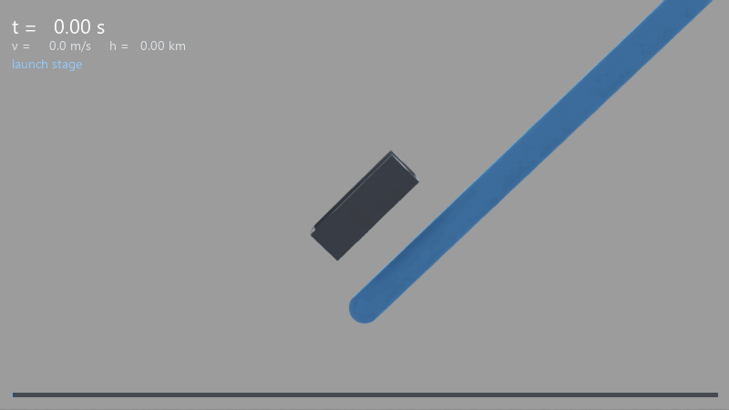
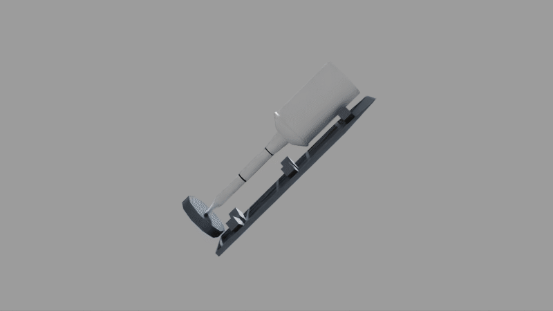

# skyArc

A vacuum-tube electromagnetic launch simulation, built on NVIDIA Isaac Sim, that exists to
answer one question:

> **Can a ground-based vacuum-tube launcher replace a launch vehicle's first stage?**

A cart carries a rocket up a staged, upward-curving tube whose interior grades from vacuum
to the ambient air density at its exit altitude. At the exit the launcher releases the
rocket and brakes the cart on a separate track; the rocket continues ballistically and
lights its own motor. Everything here — the staging, the curve, the release at altitude,
the parameterisation — serves the question above.

The upper stage is deliberately **not** simulated. Modelling one answers a different and
much larger question, so it is represented by four parameters and the launcher's delivered
state is scored against them. See `DESIGN_REVIEW.md` section 10.6.



**The flight.** A chase camera follows the assembly up the tube from the entrance to the
exit plane at t=54.114 s, then the last 1.6 s play back roughly ten times slower: the
coupling releases, the cart brakes onto its own track, and the rocket carries on. The
caption is read from the same telemetry row that placed the vehicle in each frame, so the
numbers cannot drift from the picture — 0 to 2,032 m/s and 31.8 km over 81 frames.

Every pose is **replayed from the recorded mission**, not re-simulated, so this animation
cannot show motion the physics did not produce. The tube itself is hidden and replaced by
the coloured rail below the vehicle; ticks are 1 km apart. See [Rendering](#rendering).



The vehicle at rest: the open-front U cradle holding the rocket cylinder, at its t=0
seating with the rocket's centre of mass at the tube entrance. Here **only the camera
moves** — this one is geometry, not a flight. The tube is hidden for the same reason as
above.

For the launcher's overall shape, `artifacts/production/renders/full_system.png` is a still
of the whole 54 km arc.

## Current result

A complete mission has run end to end on CPU PhysX:

| Quantity | Value |
|---|---|
| Exit speed | 1999.9254 m/s (3.7e-5 relative to target) |
| Handoff altitude | 31.267 km |
| Peak centerline tracking error | 0.46 mm against a 50 mm limit |
| Peak resultant load | 9.066 G against a 10 G limit |
| **Ideal delta-v supplied to a 200 km orbit** | **2,030 m/s** |

A ground launch additionally pays roughly 1,500–2,000 m/s of drag and gravity loss that a
31 km handoff largely avoids, so the launcher's effective contribution is comparable to a
first stage's 2,500–3,500 m/s. The binding constraint is now the upper stage: at a 500 m/s
loss allowance, a 350 s / 0.85-mass-fraction stage closes the gap to orbit by only 12 m/s.

Read those numbers with section 10.6's stated limits in mind. The delta-v screen is a
single impulsive energy raise; it ignores where the impulse is applied, plane change and
finite-burn losses, and its loss allowance is a declared input rather than a measured one.

## Documents

| File | Role |
|---|---|
| `DESIGN_REVIEW.md` | **The authority.** Requirements, physics contracts, qualification evidence, and the panel decision record. Start at sections 1, 3 and 10.6. |
| `HANDOFF.md` | Implementation state: what exists, what is missing, defects found and fixed, and what to do next. |
| `standalone/README.md` | The evidence runners and what each artifact proves. |

## Layout

```
configs/      scenario configurations (schema v2 straight, v3 curved)
exts/         the Isaac Sim extension; the simulation itself
standalone/   headless runners: qualification, scene construction, mission execution
tests/unit/   pure stdlib tests, no Isaac Sim import
artifacts/    qualification and production evidence -- tracked, not build output
```

The extension package is Isaac-free except for four boundary modules (`extension.py`,
`effects/backends/isaac.py`, `launcher/scene.py`, `launcher/production_runtime.py`). That
is enforced by a test that parses the imports, not by convention — the bundled interpreter
cannot import `numpy` outside a Kit application, so a stray import makes the whole unit
suite unrunnable.

## Running it

Everything uses the Isaac Sim build's bundled interpreter. `python` on PATH will not work.

```powershell
cd C:\Dev\Isaacsim\IsaacSim\_build\windows-x86_64\release

# Unit suite: pure Python, no Kit application, ~45 s
.\python.bat -m unittest discover -s <repo>\tests\unit

# Build the scene and render the authored views
.\python.bat <repo>\standalone\run_launcher.py --headless `
    --capture-dir <repo>\artifacts\production\renders

# Execute a mission. Omit --max-steps to run to COMPLETE (~50 min at 1 ms).
.\python.bat <repo>\standalone\run_mission.py --headless --max-steps 5000 --reset-replay
```

Drop `--headless` from `run_launcher.py` to explore the scene interactively.

## Rendering

```powershell
# Still frames at both scales
.\python.bat <repo>\standalone\run_launcher.py --headless `
    --capture-dir <repo>\artifacts\production\renders

# The mission flythrough, replayed from a completed run's telemetry
.\python.bat <repo>\standalone\render_mission.py `
    --telemetry <dir containing telemetry.csv> `
    --output <repo>\docs\media\mission_flythrough.gif

# The static vehicle revolve
.\python.bat <repo>\standalone\run_launcher.py --headless `
    --capture-orbit <repo>\docs\media\vehicle_orbit.gif `
    --orbit-view vehicle --orbit-mode revolve --orbit-frames 48 `
    --orbit-tube-opacity 0 --key-intensity 3000 --dome-intensity 250
```

Three limits are worth knowing before you read any image here.

**Live views cannot be animated; recorded ones can.** Rigid bodies are simulated in the
translated frame of `DESIGN_REVIEW.md` section 7 while the visuals are authored in global
coordinates, so a *live* view shows the vehicle parked at the entrance for the whole 54 s.
`render_mission.py` sidesteps this by replaying a finished run: the backend adapter resolves
the frame below the recorder, so telemetry is already global and the script places bodies
straight from the record. It asserts that convention on every run — the recorded cart pose
must sit within 500 m of the reference frame, and it reads 1.21 m — because adding the
offset a second time is a silent error that puts the vehicle at 42 km instead of 21 km.
`run_launcher.py --capture-orbit`, by contrast, moves only the camera.

**Two tube scales exist, and only one is ever visible at a time.** At true scale the tube
is roughly a fourteenth of a pixel wide from system-scale distance, so that view swaps in
an exaggerated schematic band. Each render records `schematic_tube` so no reader mistakes
the band for the real bore. Section 13.4 covers this.

**The renderer's step advances physics, not just the frame.** `rep.orchestrator.step()`
drives the timeline, so an unrestrained assembly accelerates backward down the tube at
`-g sin(theta)` while frames settle — far enough, in a four-frame test, to leave the view
entirely. `--capture-orbit` therefore makes both bodies kinematic and re-seats them each
frame, so every frame shows the same t=0 configuration from a different angle. The older
still in `artifacts/production/renders/` predates that fix and shows a cart that has
already slid off its seat.

## Evidence is bound to source

Qualification artifacts record a SHA-256 closure over the whole backend-neutral package,
and the test suite recomputes it. **Any edit to a `.py` file under the extension package
invalidates the Phase 0 curved-guide evidence and the suite goes red until it is
regenerated** — roughly an hour of simulation. That is deliberate: it guarantees no bound
result outlives the code that produced it. Batch core edits and requalify once.

`standalone/README.md` has the regeneration commands.

## Status

The backend-neutral core, the production Isaac layer, and mission execution are
implemented. Not yet implemented: a trajectory-conditioned ignition trigger (the rocket
currently lights 0.56 s after release rather than coasting to altitude), delivered-state
outputs and a parameter sweep runner, and the visualization layer. Animated mission
rendering is blocked on a coordinate-frame issue described in `HANDOFF.md`.

## License

Apache-2.0. See `LICENSE`.
